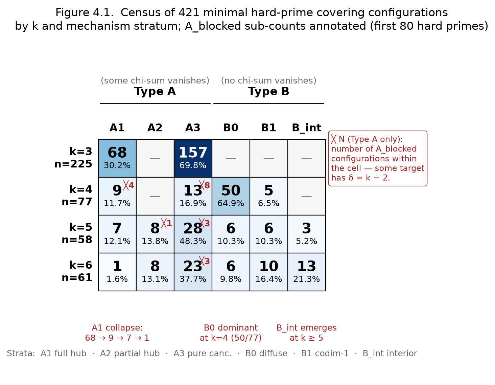
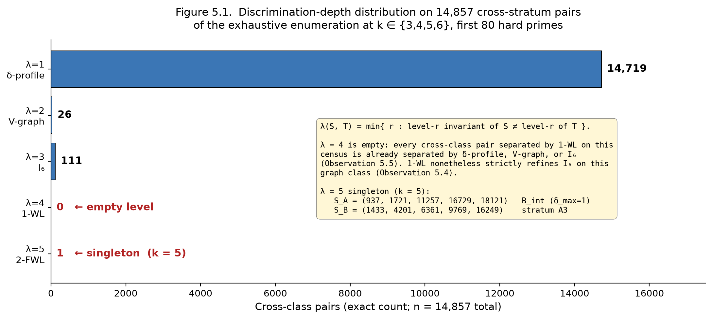
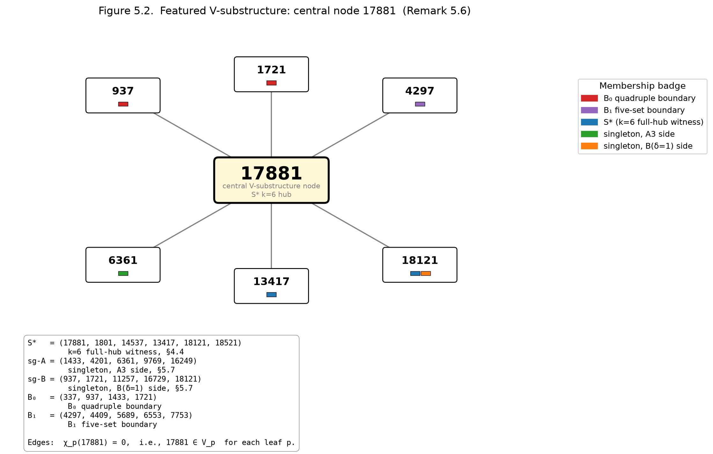

# Minimal Covering Configurations of Hard Primes: A Cofactor-Cycle Theorem and the Arithmetic Floor of a 2-Primary Census

**Malek Alhazmi**
*CytherAi ([cytherai.com](https://cytherai.com))*
*2026*

*Code and reproducibility artifacts: see §8. Paper licensed under CC BY 4.0; accompanying code licensed under the MIT License.*

---

**Abstract.** The cofactor of every full-hub minimal covering of hard primes is forced to a single chordless directed cycle, with an exact size cutoff; we exhibit the unique size-6 instance. We then locate the arithmetic floor of the census: a reciprocity-symmetric skeleton model with uniform higher digits, evaluated exactly, accounts for the bulk of the modulus-8 transversal excess and for the QNR over-selection that the framework had presented as arithmetic residues. Its two deciding constants are rationals — R(3,3,3,3) = 1373/5300 and R(3,3,3,4) = 1123/4215 — so the depth-flatness the earlier Monte-Carlo estimates suggested is exactly false, and the census moves against the model with depth rather than with it. A companion realization theorem [A26] proves that the skeleton is the exact per-prefix and iterated arithmetic law and that every admissible support state occurs. What remains open is whether the simultaneous-height census regime converges to that law.

A *hard prime* is a prime p ≡ 1 (mod 4) with ord_p(2) odd. The canonical 2-primary character χ_p maps (Z/p²Z)* to C_{2^{t_p}}, where t_p = v_2(p − 1), and V_p denotes ker χ_p restricted to the hard-prime universe. A set S of hard primes is a *minimal covering* if every pair {a, b} ⊆ S admits a witness x ∈ S with χ_x(a) + χ_x(b) ≡ 0 (mod 2^{t_x}) and no proper subset has this property. A minimal covering is *full-hub at x* (Type A1) if every other prime of S lies in V_x.

**Cofactor-cycle theorem.** For every A1 minimal covering S = {x} ∪ C, the cofactor C is a single chordless directed cycle in G_x[V_x], the induced subgraph of the canonical 2-primary digraph on V_x. Minimality forces every cofactor vertex to be *critical* — removing it breaks pair-coverage at some other vertex — and criticality forces the predecessor map on C to be a bijection, which forces in-degree and out-degree exactly 1 at every cofactor vertex; the induced subgraph is therefore a disjoint union of chordless directed cycles (Theorem A). Multi-cycle unions strictly contain a smaller A1 minimal covering (the hub together with one of the cycles) and are excluded by containment-minimality (Theorem B).

**Structural cutoff.** Every hard prime satisfies p ≡ 1 (mod 8) — by the second supplement of quadratic reciprocity, since ord_p(2) odd makes 2 a quadratic residue mod p — and so t_p ≥ 3 (depth lemma). Setting K(N) = max_x |V_x| over the first N hard primes, no A1 minimal covering of size k > K(N) + 1 can exist in this universe. We compute K(80) = 19, attained at x = 17209; the structural cutoff is k ≤ 20.

**The unique size-6 A1 instance.** The set S* = {17881, 1801, 14537, 13417, 18121, 18521} is the unique A1 minimal covering at size 6 in the first 80 hard primes — *not* the first known size-6 minimal covering (the census contains 61 at k = 6, distributed across the six primary structural strata (plus the A_blocked refinement flag)) but the unique one with full-hub structure. The A1 census reconstructs exactly from the cycle theorem as 68, 9, 7, 1 at k = 3, 4, 5, 6 (matching independent enumeration); the theorem predicts exactly 1 A1 minimal covering at k = 7.

**The arithmetic floor at modulus 8.** Two phenomena in the *zero-defect* regime (δ_x(S) = 0 at every target) had been presented as arithmetic residues: a transversal over-selection at modulus 8 and a QNR over-selection in the conditioned cofactor. Restricted to minimal coverings at k = 5 with a depth-3 hub x, witness count w_x = 2, and all-QNR cofactor (χ_x-values all in {1, 3, 5, 7} ⊂ Z/8), the unique multiset producing σ_x = 0 is the complete transversal (1, 3, 5, 7) of the two QNR negation-classes {1, 7} and {3, 5}; its local iid-uniform-QNR baseline is 1/5, and the empirical rate is 0.266 at cofactor depth-profile (3, 3, 3, 3). A reciprocity-symmetric skeleton model — one shared Legendre coin per pair (quadratic reciprocity), uniform higher 2-adic digits, conditioned on {covering, minimal, zero-δ} — is evaluated *exactly*: conditional on the parity coins its rows are independent, and integer dynamic programming over the 1,024 labeled parity graphs gives R(3, 3, 3, 3) = 1373/5300 = 0.2591 and R(3, 3, 3, 4) = 1123/4215 = 0.2664 (§6.2, §8.9; the retained Monte-Carlo pools of 9,267 and 11,821 cells validate the two constants to within 0.06 pp and 0.03 pp). Depth-flatness of the benchmark is therefore false — the constant rises by exactly 0.7373 pp from (3, 3, 3, 3) to (3, 3, 3, 4) — and the census moves the other way: observed 201/756 = 0.2659 at (3, 3, 3, 3), 0.68 pp above the constant, against 844/3379 = 0.2498 at the pre-registered depth-(3, 3, 3, 4) cell, 1.67 pp below it; both differences are reported as counts against exact constants, without a significance statement. The companion realization theorem [A26] proves that the skeleton support is fully realized and that its product measure is the exact iterated arithmetic law. The opposite-signed depth movement is therefore a simultaneous-height frequency question, not a support question (Question 6.2.G).

**Scope.** The k ≤ 6 enumeration over the first 80 hard primes is exhaustive (421 minimal coverings, distributed across six primary structural strata (plus the A_blocked refinement flag) by the local defect invariant); the k = 5 zero-δ extension at N ∈ {100, 120, 140, 160} supplies the per-universe trajectories; each universe is enumerated, not sampled, so its rates are exact properties of that census. An audit script independently re-derives every cited number and matches an independent reference table at four cross-check points. The χ_x are the 2-primary character maps used in the Turyn cofactor test [T65] for Barker-sequence non-existence; we do not extend that test's reach or claim a new Barker obstruction. The contribution is the structural theorem on the A1 cofactor and its cutoff; the reduction of the modulus-8 residues to one layer of arithmetic by a reciprocity-skeleton law evaluated exactly (R(3,3,3,3) = 1373/5300, R(3,3,3,4) = 1123/4215, depth-flatness exactly false), with global support and the iterated law supplied by the companion theorem [A26] but the simultaneous-height census movement still open; an exhaustive classification on which both rest; and the methodological discipline — null construction as the engine of every verdict — by which the residues were isolated and then dissolved.

---

## 1. Introduction

Hard primes — primes p ≡ 1 (mod 4) with ord_p(2) odd — are those for which the single-prime Turyn cofactor test [T65] does not eliminate a Barker-candidate length n = 4N². Multi-prime extensions of the Turyn lineage (Schmidt [S99], Leung–Schmidt [LS05, LS12, LS16]) combine conditions across primes via cyclotomic-field machinery, handling most known parameter regimes. The character data underlying these tests carry combinatorial information that the analytic methods do not use directly. This paper studies the finite combinatorial structure induced by these character relations.

The motivating problem is the nonexistence of long Barker sequences and its stronger companion, the circulant Hadamard (Ryser) conjecture — no circulant Hadamard matrix of order greater than 4 — which implies it. The odd-length Barker cases are settled (Turyn–Storer); the even-length cases (length 4N², N > 1) remain open, established only up to large bounds and across wide parameter ranges by the field-descent program [S99, LS05, LS12, LS16] and the Wieferich-pair computations [BM1, BM2]. We flag, to forestall confusion from the recent literature, that several preprints claiming to settle the circulant Hadamard conjecture have appeared (Hurley–Hurley–Hurley, 2011; arXiv:2302.08346, 2023, among others); none has been refereed or accepted, and the field's standing response to such claims — the explicit-counterexample refutation of the first by Craigen and Jedwab [CJ11] — has not been answered for the later ones. We therefore treat the conjecture as open, consistent with the survey literature [J08]; none of our results depends on its resolution in either direction.

For each hard prime x the *2-primary character* χ_x : (Z/x²Z)* → C_{2^{t_x}} is the group homomorphism whose kernel V_x is the unique odd-order subgroup of (Z/x²Z)*; χ_x(q) = 0 iff ord_{x²}(q) is odd. A set S of hard primes is *covering* if for every pair {a, b} ⊆ S some x ∈ S satisfies χ_x(a) + χ_x(b) ≡ 0 (mod 2^{t_x}), and *minimal* if no proper subset is covering. The *local defect* at x ∈ S is δ_x(S) = |V_x ∩ (S \ {x})|, counting how many other primes of S lie in V_x. The defect interpolates between two extremes — *full hub* (δ_x = k − 1) and *no hub* (δ_x = 0) — with intermediate values describing partial hubs and configurations where coverage arises from arithmetic cancellation rather than from kernel concentration.

Our main result is a structural theorem on the A1 cofactor combined with an exact evaluation of the reciprocity-skeleton law against which the census's modulus-8 residues are measured. At the A1 spine, the cofactor of every full-hub minimal covering is forced to a single chordless directed cycle in G_x[V_x], with the structural cutoff k ≤ K(N) + 1 (K(N) = max_x |V_x| over the first N hard primes; K(80) = 19), exhibited at the unique size-6 instance S* = {17881, 1801, 14537, 13417, 18121, 18521} which Theorem B reconstructs as the unique full-hub configuration at its size (§4.4, §4.5; Theorem A, Theorem B). Beyond A1, two phenomena at the k = 5 zero-defect regime and modulus 8 — a transversal over-selection (the +6.6 pp excess over the local iid 1/5 baseline at cofactor depth-profile (3,3,3,3)) and a QNR over-selection — had been posed as arithmetic residues. We show both are combinatorial: a reciprocity-symmetric skeleton law (one shared Legendre coin per pair, uniform higher 2-adic digits, conditioned on {covering, minimal, zero-δ}) is evaluated exactly — R(3,3,3,3) = 1373/5300 = 0.2591 and R(3,3,3,4) = 1123/4215 = 0.2664, by integer dynamic programming over the 1,024 labeled parity graphs, with the retained Monte-Carlo pools agreeing to within 0.06 pp — and it reproduces the QNR over-selection and the witness-count distribution. The companion realization theorem [A26] proves that this is the exact per-prefix and iterated arithmetic law and realizes every admissible support state. Depth-flatness is exactly false (+0.7373 pp from (3,3,3,3) to (3,3,3,4)), and the simultaneous-height census moves opposite to it: observed 0.2659 at (3,3,3,3) against 0.2591, and 844/3379 = 0.2498 at the pre-registered depth-(3,3,3,4) cell against 0.2664; we report the counts without a significance statement (§8). The program's one measured signal beyond mod-2 reciprocity — a pair-level law in the depth-(3,3) even sector, with the depth-(3,4) channels flat (§6.2) — is consequence-free for the deciding observable, by exact computation: injecting the measured joints moves the modelled depth-(3,3,3,4) rate from 1123/4215 = 0.2664294 only to 0.2663959, which is 0.2% of the distance to the observed 844/3379 = 0.2498. The opposite-signed finite-census residuals are the point of departure for Question 6.2.G. The §6.2 cross-target conditional geometry is a set of counts contrasted against baselines fitted in-sample; only its structurally forced cell is derived, and the rest are descriptive. The 2-primary framework is empirically incomplete at k = 5 zero-defect: the Type B fraction reaches a ~14% band by N = 120 and remains in that band across N = 120..160 (the smaller universes N = 80, 100 sit at 30% and 19%).

This structural account is made precise on an exhaustive census of 421 minimal covering configurations at k = |S| ∈ {3, 4, 5, 6} in the universe of the first 80 hard primes, distributed across six primary structural strata indexed by the defect profile, with A_blocked an overlapping refinement flag rather than a seventh stratum: three *elimination* mechanisms — full hub, partial hub, pure cancellation — at which the Turyn cofactor test fires for distinct structural reasons; three *survival* regimes — diffuse, codimension-one blocked, and a previously-unnamed *interior* regime populated at k ≥ 5 — at which the test does not fire at any target in S; and, cutting across these, the A_blocked refinement flag marking configurations in which elimination fires at one target while a near-hub elsewhere in S is locally blocked. Pure-cancellation dominates the elimination strata at 221 of 322 configurations, and the survival strata are the majority population at k = 4 (55 of 77). The k = 4 zero-defect regime is structurally forced: every minimal k = 4 covering with empty V-graph is Type B0, by a minimality argument on the chi-sum at a hypothetical elimination target (Proposition 4.4). We exhibit S* = {17881, 1801, 14537, 13417, 18121, 18521} as the *unique* full-hub minimal covering at its size in the first 80 hard primes — the census contains 61 minimal coverings at k = 6 across the six primary structural strata (plus the A_blocked refinement flag), and S* is the unique one with full-hub structure (Theorem B, §4). The exhaustive classification is the empirical substrate on which both the cofactor-cycle theorem at the A1 spine and the baseline-referenced residue at zero-δ are made precise.

Beyond the static taxonomy we measure the structural complexity required to discriminate strata. The measurement uses two formally-separated notions — *refinement strength* (partition containment) and *marginal discrimination contribution* on a fixed ordered ladder — and an exhaustive census of cross-class pairs. The ladder consists of the δ-profile, the V-graph isomorphism class, the I_6 joint cancellation multiset, and 1- and 2-dimensional Weisfeiler–Lehman refinement on the bipartite cancellation+membership graph of S. On the 14,857 cross-stratum pairs over the 421 enumerated configurations, the local defect invariant δ alone first separates 14,719; V-graph and I_6 cover 137 further; 1-WL contributes no additional separations on this census (despite strictly refining I_6 in refinement strength); a single residual cross-class pair at k = 5 requires 2-FWL. The empty marginal contribution at 1-WL is a co-occurrence pattern across the lower levels, not a sign that 1-WL is the weaker invariant. The covering extremum S* and this discrimination extremum share a further structural property: the 21 hard primes appearing across them and the previously-known boundary configurations form a V-subgraph denser than 99.7% of equal-size random subsets of the universe — a substructure-level concentration robust to single-vertex perturbation.

We do not extend the reach of the Turyn cofactor test or claim a new obstruction to Barker sequences. The contribution is: (i) the cofactor-cycle theorem on A1 minimal coverings with its exact cutoff (§4.4); (ii) the reduction of the modulus-8 residues — a transversal over-selection and a QNR over-selection — to the theorem-derived reciprocity-skeleton law, evaluated exactly (R(3,3,3,3) = 1373/5300, R(3,3,3,4) = 1123/4215; depth-flatness exactly false at +0.7373 pp), with the depth-(3,3,3,4) cell reported as counts only (844/3379 = 0.2498, on the opposite side of its exact constant 0.2664 from the (3,3,3,3) cell), resolving support and iterated frequencies through [A26] while leaving simultaneous-height convergence as Q6.2.G; (iii) an exhaustive classification on which both rest (421 minimal coverings at k ≤ 6, six primary structural strata (plus the A_blocked refinement flag), the k = 5 zero-defect extension to N = 100..160, where the Type B fraction is 18.9%, 14.0%, 13.5%, 14.2%); (iv) a comparative discrimination result on the strata; and (v) the methodological discipline — null construction as the engine of every verdict — by which the residues were isolated and then dissolved (§7). The §6.2 cross-target conditional-geometry observations — conditional anti-correlation in shared-inner-cofactor cells, conditional independence at α_both = 0, one cell structurally forced to zero by Proposition 6.2.1 — are counts from the enumerated censuses contrasted against baselines fitted in-sample (Q6.2.A, Q6.2.C, Q6.2.F); only the forced cell is derived, and none of the others carries an inferential interpretation. All numerical claims are independently verifiable from a public repository which includes the 421-configuration cache, the structural-baseline scripts, the per-(t, w) and depth-profile analysis scripts, the audit script that reproduces every cited number, and a clean-room reimplementation of the algebraic primitives.

The paper is organized as follows. §2 fixes the framework's algebraic vocabulary. §3 describes the enumeration procedure and the universe. §4 presents the taxonomy and the cofactor-cycle theorem at the A1 spine (§4.4: depth lemma, structural cutoff k ≤ K(N) + 1 = 20, Theorem A on minimal predecessor-cover structure, Theorem B on the single chordless cycle at A1, exact reconstruction of the A1 census), the unique size-6 A1 instance S* (§4.5), and the zero-δ regime with Propositions 4.4 and 4.6 (§4.7). §5 develops the refinement ladder, the V-substructure observation, and the discrimination claim. §6 collects open questions, organized by baseline type: §6.1 derives the A1 collapse within the cutoff and isolates the minimality-decay rate as the within-cutoff open counting question; §6.2 isolates two residues measured against parameter-free references — Q6.2.B, the transversal over-selection at modulus 8, against the *local* iid 1/5 baseline, and Q6.2.E, the QR-entry deviation, against the *theorem*-baseline of Chebotarev equidistribution — together with three model-baseline open problems (Q6.2.A, Q6.2.C, Q6.2.F) and Q6.2.G, now the simultaneous-height convergence question after [A26] resolves support and the iterated law. §7 develops the methodological meta-result with the self-application caveat made explicit (§7.5): five worked confound-stripping instances are real per-instance; the cross-instance recurrence is partly the method's autocorrelation, held as working hypothesis rather than discovered invariant. §8 is reproducibility. Appendix A records the calibration log of the conditioning chain that produced §6.2 in the same four-component schema.

## 2. The framework

This section fixes the algebraic vocabulary the rest of the paper uses. It introduces hard primes, the 2-primary character χ_x and its kernel V_x, the covering and minimality predicates, and the local defect δ_x. It states one genuine algebraic lemma (parity symmetry, derived from quadratic reciprocity) and four structural observations consequent on the definitions.

### 2.1 Hard primes and the 2-primary character

For an odd prime x, the unit group U_x := (Z/x²Z)* is cyclic of order φ(x²) = x(x − 1) = 2^{t_x} · m, with m odd and t_x = v_2(x − 1) the 2-adic depth at x. The group U_x admits a unique subgroup H_x of odd order, of index 2^{t_x}; the quotient is

$$Q_x \;:=\; U_x / H_x \;\cong\; C_{2^{t_x}}.$$

We call x a *hard prime* if x ≡ 1 (mod 4) and the multiplicative order of 2 modulo x is odd. Hard primes are precisely the primes for which the single-prime Turyn cofactor test [T65] does not eliminate a Barker-candidate length n = 4N² having x as a divisor of N; they are the residual primes that the multi-prime Turyn lineage must combine.

The *2-primary character* χ_x : U_x → Q_x ≅ C_{2^{t_x}} is the canonical quotient map. We use it as a group homomorphism into an abelian group written additively (mod 2^{t_x}). For p ∈ U_x:

- χ_x(p) = 0  iff  p ∈ H_x  iff  ord_{x²}(p) is odd.
- χ_x(pq) = χ_x(p) + χ_x(q)  (mod 2^{t_x}).

We write V_x := { hard primes p : χ_x(p) = 0 } = (the hard primes in H_x), the *kernel of χ_x* restricted to the hard-prime universe.

### 2.2 Coverings and minimal coverings

A set S of hard primes is a *covering* if for every unordered pair {a, b} ⊆ S, there exists some x ∈ S satisfying

$$\chi_x(a) + \chi_x(b) \;\equiv\; 0 \;\;(\text{mod } 2^{t_x}).$$

The element x ∈ S is a *witness* for the pair {a, b}. S is *minimal* if no proper subset S' ⊊ S is covering.

A covering set encodes a pair-cancellation structure inside the 2-primary quotients of its members; minimality picks out the irreducible such structures. Both predicates are decidable by exhaustive search at fixed k = |S|; §3 describes the enumeration algorithm.

### 2.3 Local defect and cofactor chi-sum

Two scalar invariants attached to each target x ∈ S are used throughout the paper.

The *local defect* at x:

$$\delta_x(S) \;:=\; |\,V_x \cap (S \setminus \{x\})\,|,$$

counting how many other primes in S lie in the kernel of χ_x.

The *cofactor chi-sum* at x:

$$\sigma_x(S) \;:=\; \sum_{q \in S,\, q \neq x} \chi_x(q) \;\;(\text{mod } 2^{t_x}).$$

We call x an *elimination target* of S if σ_x(S) = 0; equivalently (by the homomorphism property of χ_x), if the product of the cofactor lies in H_x and therefore has odd multiplicative order mod x². The classical Turyn cofactor test [T65] fires at x in this case: the Barker candidate n = 4(∏ S)² is eliminated by the self-conjugacy condition at x.

A configuration S is *Type A* if some target in S is an elimination target, *Type B* otherwise. §4 refines this dichotomy into the seven-cell taxonomy.

### 2.4 Lemma (parity symmetry)

The framework has one genuinely algebraic content statement, a consequence of quadratic reciprocity.

**Lemma 2.1.** *For distinct hard primes p, q:*

$$\chi_p(q) \;\equiv\; \chi_q(p) \pmod{2}.$$

*Proof.* The parity of χ_p(q) is the Legendre symbol (q/p) — the first bit of the 2-adic decomposition of ord_{p²}(q). Since p ≡ q ≡ 1 (mod 4), quadratic reciprocity gives (p/q)(q/p) = (−1)^{(p−1)(q−1)/4} = 1, hence (q/p) = (p/q), and the parities of χ_p(q) and χ_q(p) agree. ∎

**Corollary 2.2.** *If q ∈ V_p (i.e., χ_p(q) = 0), then χ_q(p) is even.*

Lemma 2.1 is the only place in the paper where the main statement of quadratic reciprocity is invoked. The depth lemma of §4.4 separately invokes the *second supplement* (2 is a quadratic residue mod p iff p ≡ ±1 (mod 8)) to upgrade the hard-prime parity from p ≡ 1 (mod 4) to p ≡ 1 (mod 8).

### 2.5 Two structural observations

The next two statements are *observations* — direct consequences of the definitions in §§2.1–2.3. They are recorded here because the rest of the paper uses the vocabulary they introduce.

**Observation 2.3 (the kernel as automatic witness).** Let x be a hard prime and let p, q ∈ V_x. Then χ_x(p) + χ_x(q) = 0 + 0 = 0, so x is a witness for the pair {p, q} in any set S containing {x, p, q}.

This is the homomorphism property of χ_x applied to elements of its kernel. We record it because the V-graph (§5) and the local defect δ_x (§2.3) are both organised around it.

**Observation 2.4 (Hub Self-Defeat).** If S = {x} ∪ C is a covering with C ⊆ V_x (a *full-hub* configuration at x), then σ_x(S) = 0, i.e., x is an elimination target. Consequently every full-hub covering is Type A.

*Proof.* σ_x(S) = Σ_{q ∈ C} χ_x(q) = Σ_{q ∈ C} 0 = 0. ∎

§4 reports the empirical reach of this mechanism — the A1 stratum density across k — and §6 quantifies how that reach decays.

**Observation 2.5 (codimension-one blockage).** If S is a covering of size k and some target y ∈ S satisfies δ_y(S) = k − 2, then σ_y(S) is the single nonzero summand among the (k − 1) χ-values at y, hence σ_y(S) ≠ 0 (mod 2^{t_y}). In particular y is not an elimination target of S.

*Proof.* δ_y(S) = k − 2 means exactly one prime p* ∈ S \ {y} has χ_y(p*) ≠ 0. Hence σ_y(S) = χ_y(p*) ≠ 0. ∎

This is the *codimension-one near-hub* observation, the empirical mechanism behind the B1 stratum and the A_blocked refinement of §4.2.

### 2.6 The cycle graph and the General Coverage observation

The directed graph G_x on the hard primes ≠ x has edge p → q iff χ_p(q) = −χ_p(x) (mod 2^{t_p}). Equivalently, p → q iff p covers the pair {x, q}.

**Observation 2.6 (General Coverage).** Let x be a hard prime, and let p_0, ..., p_{k−1} ∈ V_x form a directed k-cycle in G_x with k ≥ 2. Then S = {x, p_0, ..., p_{k−1}} is a covering (k+1)-set.

*Proof.* For pairs (p_i, p_j) with both non-hub: χ_x(p_i) = χ_x(p_j) = 0 by V_x-membership, so their sum vanishes; x witnesses these pairs. For pairs (x, p_i): the cycle edge p_{i−1} → p_i means χ_{p_{i−1}}(p_i) = −χ_{p_{i−1}}(x), hence χ_{p_{i−1}}(x) + χ_{p_{i−1}}(p_i) = 0, so p_{i−1} witnesses the pair (x, p_i). All C(k+1, 2) pairs are witnessed. ∎

§4.5's k = 6 witness S* is the unique full-hub configuration arising from a directed 5-cycle in G_{17881} in the enumeration (Theorem B).

## 3. Exhaustive enumeration

### 3.1 The universe

We fix the *universe* to be the first 80 hard primes — the primes p ≡ 1 (mod 4) with ord_p(2) odd, ordered increasingly:

$$p_1, p_2, \ldots, p_{80} \;=\; 73,\, 89,\, 233,\, \ldots,\, 19249.$$

The largest, p_80 = 19249, with p_78 = 18521 and p_79 = 18617. All enumerations report configurations as subsets of {p_1, ..., p_80}. The hard-prime decision procedure (Miller–Rabin primality plus multiplicative-order computation) is implemented in `barker.arithmetic` and `barker.sweep` of the code library (§8).

The choice of 80 is a methodological parameter, not a structural one: it is the number of hard primes for which the enumeration at k = 6 is computationally tractable on a single workstation (the C(80, 6) ≈ 3 × 10⁸ subsets at k = 6, with pruning, finish in approximately 50 minutes wall-clock; see §3.6).

### 3.2 Decision procedures

For a candidate subset S ⊆ {p_1, ..., p_80} of size k, two predicates are tested.

**Covering.** S is a covering (§2.2) iff for every pair {a, b} ⊆ S there exists x ∈ S with χ_x(a) + χ_x(b) ≡ 0 (mod 2^{t_x}). The pair-witness table χ_x(p) for all pairs (p, x) in the universe is precomputed as the *2-primary character table* (`barker.two_primary.build_two_primary_table`); the covering test is then a constant-time membership check per pair, O(k³) per candidate S.

**Minimality.** S is a *minimal* covering iff S is a covering and no proper subset S' ⊊ S is a covering.

It is **not** sufficient to test only the k single-element deletions S \ {y}: coverage is not monotone under deletion. In the universe of §3.1,

$$S \;=\; \{73,\, 233,\, 1721,\, 4057,\, 18121\}$$

is a covering, all five of its 4-element subsets are non-covering, and yet {73, 233, 1721} ⊊ S is a covering. The one-deletion test would certify S as minimal, which it is not. (Deleting an element removes both potential witnesses and the pairs that need witnesses; neither effect dominates, so coverage is monotone in neither direction.)

Subsets of size ≤ 2 are never covering — a pair {a, b} requires a witness x ∈ S \ {a, b} — so the test scans proper subsets of sizes 3, …, k − 1, giving Σ_{j=3}^{k−1} C(k, j) covering tests of O(k³) each.

Equivalently, since every covering set contains a minimal covering, S is minimal iff S contains no *minimal* covering of strictly smaller size. That is exactly the containment index of §3.3, which is why the enumeration of §3.4 records minimal coverings correctly.

### 3.3 Pruning

A naive exhaustive enumeration at k = 6 would walk C(80, 6) ≈ 3 × 10⁸ subsets. Two pruning rules cut this by orders of magnitude.

**Universal-bad-pair pruning.** A pair (a, b) is *universal-bad* if no x ∈ {p_1, ..., p_80} \ {a, b} satisfies χ_x(a) + χ_x(b) ≡ 0 mod 2^{t_x}. Any covering set must avoid containing a universal-bad pair (otherwise that pair has no witness in the universe, hence no witness in any S ⊆ universe). The universal-bad pairs are precomputed once during table construction; candidate subsets containing one are skipped.

**Known-minimal containment pruning.** If a candidate subset S strictly contains a known minimal covering S' ⊊ S (from a smaller enumeration round, k = 3, 4, 5), then S cannot itself be minimal: the proper subset S' is already a covering. Maintaining an index of all minimal coverings found at smaller k allows the search to skip such candidates immediately.

The combination is implemented in `barker.minimal_cover_search.BadPairIndex`. Empirically, the two prunings reduce the k = 6 candidate count from ≈ 3 × 10⁸ to fewer than 10⁷ actual covering tests on the first 80 hard primes.

### 3.4 The search procedure

For each k ∈ {3, 4, 5, 6}, the enumeration walks subsets of size k in lexicographic order, applying the prunings of §3.3 before the covering test:

```
for each k in (3, 4, 5, 6):
    for each subset S of size k, in lex order:
        if S contains a universal-bad pair: skip
        if S strictly contains a previously-found minimal covering: skip
        if not is_covering(S): continue
        if no proper subset of S of size 3..k-1 is covering:
            record S as a minimal covering at k
```

The minimal coverings found at k are added to the index used by the (k + 1) search. Because the index is complete for every size below k, the containment prune already implies the final test; the explicit proper-subset scan is retained as an independent check that does not depend on the completeness of the index.

### 3.5 Classification at recording time

Each minimal covering S found in §3.4 is classified into one of the six mechanism strata of §4.2 by computing the per-target defect δ_x(S) and cofactor chi-sum σ_x(S), and applying the partition

```
elim = { x ∈ S : σ_x(S) = 0 }
if elim is non-empty:
    let d_max = max{ δ_x(S) : x ∈ elim }
    if d_max == k − 1:  stratum = A1     (full hub)
    elif d_max ≥ 2:     stratum = A2     (partial hub)
    else:               stratum = A3     (pure cancellation)
else:
    let d_max = max{ δ_x(S) : x ∈ S }
    if d_max == 0:       stratum = B0    (diffuse)
    elif d_max == k − 2: stratum = B1    (codim-1 blocked)
    else:                stratum = B_int (interior, max δ = d_max)
```

The blockage refinement A_blocked is computed at the same time as a secondary annotation: a configuration is A_blocked iff its stratum begins with A and some target satisfies δ_x = k − 2.

### 3.6 Computational profile

The search has been executed on commodity hardware (Apple M4, 16 GB unified memory):

| k | candidates C(80, k) | walltime  | minimal coverings |
|---:|---:|---:|---:|
| 3 |       82,160 |  < 1 s   | 225 |
| 4 |    1,581,580 |    2 s   |  77 |
| 5 |   24,040,016 |   45 s   |  58 |
| 6 |  300,500,200 | ~ 50 min |  61 |
| Σ | 326,203,956  | ≈ 50 min | **421** |

Re-running from cache is instantaneous.

### 3.7 Output and reproducibility

The enumeration's output is the file `barker_k6_bundle/research/_enumeration_cache.json` containing 421 records (k, stratum label, sorted δ-profile, sorted config primes). The full search is reproduced by

```
python3 barker_k6_bundle/research/profile_analysis.py
```

run from the repository root. On first run the script executes the full ≈ 50-minute search and writes the cache; on subsequent runs the cache is loaded directly. All downstream analyses (§§4–6 figures and tables) read from this cache. The verification path (§8) is independent of the cache.

### 3.8 Robustness probes at k = 7

The exhaustive enumeration at k = 7 over the first 80 hard primes is computationally heavier (C(80, 7) ≈ 3 × 10⁹ subsets) and has not been completed here. Two partial enumerations are reported as robustness probes:

- **k = 7, first 50 hard primes** (~17 min): 2 minimal coverings found.
- **k = 7, first 60 hard primes** (~65 min): 8 minimal coverings found, distributed as 4 A3, 2 A2, 1 B(δ=1), 1 B(δ=4).

These partial enumerations are recorded for the §6 asymptotic question (Question 6.1); they do not extend the main census.

## 4. The taxonomy

### 4.1 Enumeration summary

We exhaustively enumerated the minimal covering configurations of hard primes at k ∈ {3, 4, 5, 6} in the universe of the first 80 hard primes (§3). The full enumeration produces **421 minimal covering configurations**: 225 at k = 3, 77 at k = 4, 58 at k = 5, and 61 at k = 6.

### 4.2 Seven-cell taxonomy

For each configuration S of size k, the two invariants δ_x(S) and σ_x(S) from §2.3 are used to assign a stratum.

- **A1 — full hub.** Some elimination target has δ_x = k − 1.
- **A2 — partial hub.** The maximum defect at an elimination target is in [2, k − 2].
- **A3 — pure cancellation.** The maximum defect at an elimination target is ≤ 1; elimination arises from arithmetic cancellation, not from kernel concentration.
- **B0 — diffuse survival.** δ_x = 0 for all x ∈ S. No structural V-data available.
- **B1 — codimension-one blocked survival.** Some target satisfies δ_x = k − 2; no chi-sum vanishes.
- **B_int — interior survival.** 0 < max δ_x < k − 2; no chi-sum vanishes.

A seventh structural cell **A_blocked** records configurations that are Type A and contain a target with δ_x = k − 2. A_blocked is not a separate primary stratum but a refinement axis across A1, A2, A3.

### 4.3 Density evolution with k

Figure 4.1 displays the census on a 4 × 6 mechanism × k matrix. Three structural features dominate.



**A1 collapses with k.** The full-hub stratum drops from 68 of 225 configurations at k = 3 (30.2%) to 9 of 77 at k = 4 (11.7%) to 7 of 58 at k = 5 (12.1%) to 1 of 61 at k = 6 (1.6%). At the partial k = 7 enumeration over the first 60 hard primes, no minimal covering is A1.

**A3 dominates the elimination strata.** At k = 3 it is the only non-A1 stratum (157 of 225 = 69.8%). At k = 5 and k = 6, A3 is the largest Type A stratum (28 of 58 and 23 of 61 respectively).

**Type B is the majority at k = 4 and grows at k = 6.** Of 77 minimal 4-coverings, 55 are Type B (50 B0 + 5 B1), 71.4% of the enumeration. At k = 5 the proportion drops to 25.9%, and at k = 6 it recovers to 47.5%.

The empirical A1 collapse across k = 3..6 is not a trend to be explained — it is determined by the structural theorem of §4.4 combined with a single combinatorial filter, with one unforced parameter (the minimality-decay rate) remaining as an open counting question.

### 4.4 The A1 cofactor-cycle theorem

This subsection establishes the structural theorem the paper rests on at the A1 spine: the cofactor of every A1 minimal covering is a single chordless directed cycle, and the structural cutoff on A1 size is exact.

**Lemma (depth).** *Every hard prime x satisfies x ≡ 1 (mod 8); equivalently, t_x = v_2(x − 1) ≥ 3.*

*Proof.* Hard ⟹ ord_x(2) odd. The cyclic group (Z/xZ)* has order x − 1; an element of odd order lies in every index-2^k subgroup, in particular in (Z/xZ)*² (the index-2 subgroup of quadratic residues). Hence 2 is a QR mod x, i.e., (2/x) = +1. By the second supplementary law of quadratic reciprocity, (2/x) = +1 iff x ≡ ±1 (mod 8). Combined with the hard-prime condition x ≡ 1 (mod 4), this forces x ≡ 1 (mod 8), so t_x ≥ 3. ∎

**Definition (kernel ceiling).** *For each hard prime x in the universe, write K_x := |V_x|, and K(N) := max_x K_x over the first N hard primes.*

**Proposition (structural cutoff).** *No A1 minimal covering of size k > K(N) + 1 exists over the first N hard primes.*

*Proof.* An A1 minimal covering S of size k contains a full-hub target x with S \ {x} ⊆ V_x, so |S \ {x}| = k − 1 ≤ K_x ≤ K(N), whence k ≤ K(N) + 1. ∎

For the first 80 hard primes, direct computation gives **K(80) = 19**, attained at x = 17209. The structural cutoff in this universe is therefore **k ≤ 20**. The depth lemma bounds K(N) on any finite universe: |V_x| equals the number of hard primes (other than x) whose 2-adic order in (Z/x²Z)* is odd, of expected size on the order of N / 2^{t_x} ≤ N / 8.

We now state and prove the theorem that the cofactor of an A1 minimal covering must satisfy.

**Theorem A (minimal predecessor-cover structure).** *Let H be a finite digraph and C ⊆ V(H). Suppose every vertex of C has in-degree ≥ 1 in the induced subgraph H[C], and every vertex of C is critical: for each v ∈ C there exists w ∈ C such that v is the unique in-neighbour of w in H[C]. Then every vertex of H[C] has in-degree and out-degree exactly 1, and H[C] is a disjoint union of chordless directed cycles.*

*Proof.* Define s : C → C by s(v) = some w ∈ C of which v is the unique in-neighbour in H[C] (criticality provides such w; if more than one exists, pick any). Then s is injective: if s(v_1) = s(v_2) = w, then v_1 and v_2 are both in-neighbours of w in H[C], but uniqueness at v_1 says v_1 is *the* in-neighbour of w, so v_1 = v_2. Injectivity of s on the finite set C makes it bijective. Bijectivity gives every w ∈ C a unique pre-image v under s; combined with "v is the unique in-neighbour of w in H[C]," every w has in-degree exactly 1 in H[C].

For out-degrees: every v ∈ C has at least one out-edge in H[C], namely v → s(v) (since v is in-neighbour of s(v)), so every v has out-degree ≥ 1. The sum of in-degrees equals the sum of out-degrees on any digraph; the sum of in-degrees over C is |C| (each vertex in-degree 1), so the sum of out-degrees over C is also |C|; combined with each out-degree ≥ 1 on |C| vertices, every out-degree equals 1. A graph with in-degree and out-degree exactly 1 at every vertex decomposes into vertex-disjoint simple directed cycles; chords are excluded because any chord would push the in-degree of its head above 1. ∎

**Theorem B (A1 cofactor characterization).** *Let x be a hard prime and C ⊆ V_x. Then {x} ∪ C is an A1 minimal covering if and only if C is a single chordless directed cycle in G_x[V_x] and no subset of C is a covering.*

*Proof.* (⟹) Every pair (a, b) ⊆ S = {x} ∪ C must have a witness in S. Internal pairs in C are witnessed by x trivially (χ_x(a) = χ_x(b) = 0 since C ⊆ V_x), so the binding constraints are the pairs (x, c) for c ∈ C. The pair-witness condition χ_y(x) + χ_y(c) ≡ 0 (mod 2^{t_y}) at witness y ∈ C says y → c in G_x. So every c ∈ C has in-degree ≥ 1 in G_x[C]: C is a predecessor-cover of itself in G_x.

Minimality of S forces criticality of every c ∈ C: if c ∈ C is not critical, then S \ {c} = {x} ∪ (C \ {c}) is still covering (internal pairs witnessed by x; each (x, c′) for c′ ∈ C \ {c} still witnessed by some predecessor in C \ {c}), contradicting minimality of S. By Theorem A, G_x[C] is a disjoint union of chordless directed cycles.

Suppose G_x[C] consists of two or more cycles. Pick any single cycle C_1 ⊆ C. Then C_1 ⊆ V_x is a directed cycle in G_x, so by Observation 2.6 (General Coverage), {x} ∪ C_1 is a covering set of size |C_1| + 1 < |C| + 1 = |S|. So S strictly contains the smaller covering {x} ∪ C_1, contradicting minimality of S. Hence G_x[C] is a single cycle.

Finally, no subset T ⊆ C is a covering: if it were, T would be a covering of size ≤ |C| < |S| contained in S, contradicting minimality of S.

(⟸) Let C ⊆ V_x be a single chordless directed cycle, and suppose no subset of C is a covering. Then {x} ∪ C is a covering (internal pairs witnessed by x; each (x, c) witnessed by c's cycle-predecessor). For minimality, every proper subset of S = {x} ∪ C must fail to be a covering. A proper subset either contains x or does not.

*Subsets not containing x* are subsets T ⊆ C; none is a covering by hypothesis.

*Subsets containing x* are of the form {x} ∪ T′ with T′ ⊊ C. If {x} ∪ T′ were a covering, then T′ would be a predecessor-cover of itself in G_x (the same argument as the forward direction). By chordlessness of C, in the induced subgraph G_x[C] each vertex has exactly one in-neighbour in C (its cycle predecessor). For T′ ⊊ C non-empty, some t′ ∈ T′ has its cycle-predecessor NOT in T′, so t′ has zero in-neighbours in T′. Hence T′ is not a predecessor-cover, contradicting the covering assumption on {x} ∪ T′.

Both sub-cases fail, so no proper subset of S is a covering. Hence {x} ∪ C is a minimal A1 covering. ∎

**Remark (the second hypothesis is empirically vacuous at N = 80).** Across the first 80 hard primes, no proper subset of any single chordless directed cycle in {G_x[V_x] : x ∈ universe} is a covering: verified by direct enumeration of the 86 single chordless cycles (68 + 9 + 7 + 1 + 1 at cofactor sizes 2 through 6, summing across hubs) and exhaustive check on each of their subsets. Hence at N = 80 the biconditional simplifies to *{x} ∪ C is A1 minimal ⟺ C is a single chordless directed cycle in G_x[V_x]*. Whether the second hypothesis is vacuous in general (a covering inside C without the hub would have to satisfy the chi-sum equations among cycle vertices alone, i.e., be an A3-type minimal covering supported entirely on cycle vertices) is an unproven conjecture; we state Theorem B in full form so the biconditional remains correct in universes where the empirical observation may fail.

**Reconstruction of the A1 census.** By Theorem B, A1 minimal coverings of size k correspond bijectively to single chordless directed (k − 1)-cycles in some G_x[V_x] whose hub-extension {x} ∪ C contains no smaller minimal covering. The containment condition splits along the two sub-cases of the (⟸) proof. For proper sub-coverings *containing the hub* the exclusion is automatic: such a covering would force a strict predecessor-closed subset of C, which chordlessness forbids (a sub-cycle would be a chord). For sub-coverings *contained entirely in C* it is **not** automatic — that is exactly the second hypothesis of Theorem B (no subset of C is itself a covering), which the Remark above verifies by exhaustive enumeration of all 86 single chordless cycles and their subsets at N = 80 and which remains conjectural in general. Within the enumerated universe the reconstruction is therefore exact: the A1 count at size k equals the number of distinct A1 sets S = {x} ∪ C across hubs x and single chordless (k − 1)-cycles C ⊆ V_x. Computing directly over the first 80 hard primes by independent enumeration (Block 3b of the audit script `audit_verify.py`):

| k | distinct single chordless (k−1)-cycles | A1 census |
|---:|---:|---:|
| 3 |  68 |  68 ✓ |
| 4 |   9 |   9 ✓ |
| 5 |   7 |   7 ✓ |
| 6 |   1 |   1 ✓ |
| 7 |   1 | (predicted) |

The k = 7 entry predicts exactly 1 A1 minimal covering over the first 80 hard primes, as a consistency check for the full enumeration at k = 7. Within-cutoff: the structural cutoff k ≤ 20 leaves room for A1 in principle up through k = 20; the question of how the single-chordless-cycle count evolves as cofactor size grows — the *cycle-multiplicity curve* on G_x[V_x] — is the within-cutoff open counting question (Question 6.1, §6.1), sharpened by Theorem B but not closed by it.

**Theorem-A objects vs A1 minimal coverings.** Theorem A produces, at each cofactor size m, *in/out-degree-1 induced subgraphs* in some G_x[V_x] — a strictly larger class than single chordless cycles, because disjoint unions of chordless cycles also satisfy the degree-1 condition. The full breakdown across the 80 hubs:

| cofactor size m | single chordless cycles | disjoint unions of cycles | total Theorem-A objects |
|---:|---:|---:|---:|
| 2 | 68 |  0 |  68 |
| 3 |  9 |  0 |   9 |
| 4 |  7 | 27 (all 2+2) |  34 |
| 5 |  1 |  3 (all 2+3) |   4 |
| 6 |  1 |  5 (mix of 2+4, 3+3, 2+2+2) |   6 |

The single-cycle column is the A1 census via Theorem B (68/9/7/1/1). The disjoint-union column is the same phenomenon as the strong-form failure: at cofactor size 4, the (2+2) pair {C_1, C_2} produces a Theorem-A object {x} ∪ C_1 ⊔ C_2 that is a minimal predecessor-cover but *not* an A1 minimal covering, because it strictly contains the smaller A1 covering {x} ∪ C_1. Disjoint-union Theorem-A objects exist already in the first 80 hard primes — 27 + 3 + 5 = 35 of them across cofactor sizes 4 through 6. Of these 35, exactly 32 are two-component (a vertex-disjoint, cross-edge-free pair of chordless cycles) and 3 are three-component; so the 32 *cross-edge-free cycle pairs* are precisely the two-component objects, and 35 = 32 + 3, the surplus being the three 3-component unions, which are not pairs. (Counted instead as unordered pairs of cycles, each 3-component union supplies C(3, 2) = 3 pairs, so the cycle-pair tally is 32 + 9 = 41 — a count of cycle pairs, not of disjoint-union objects.) Either tally establishes the strong-form failure (Theorem-A objects are not all single cycles). The smallest example sits at x = 73, where (2+2) cycle pairs already produce four distinct disjoint-union Theorem-A objects; the largest disjoint structure is at x = 17209, with (2+4) and (2+2+2) configurations.

The reconstruction holds independent of these disjoint-union objects: by Theorem B's biconditional (under the empirical vacuousness of its second hypothesis at N = 80), A1 minimal coverings are exactly the single-cycle column, and the disjoint-union column does not promote — neither by Theorem B's converse nor by any "containment filter" — into A1 minimal coverings.

### 4.5 The unique k = 6 A1 instance S*

The single A1 configuration at k = 6 is

$$S^* = \{17881,\; 1801,\; 14537,\; 13417,\; 18121,\; 18521\},$$

with full-hub target x = 17881. By Theorem B, S* is determined by a single chordless directed 5-cycle in G_{17881}[V_{17881}]; direct enumeration of cycles in this induced subgraph at |V_{17881}| = 11 confirms that the 5-cycle on {1801, 14537, 13417, 18121, 18521} is the unique such structure at this hub, and (by the empirical vacuousness of Theorem B's second hypothesis at N = 80) S* is therefore the unique A1 minimal covering at k = 6 in the first 80 hard primes. The five non-hub primes lie in V_{17881} (each has χ_{17881} = 0), and the directed cycle structure 1801 → 14537 → 13417 → 18121 → 18521 → 1801 supplies the witness for each pair (17881, p_i) at p_i's cycle predecessor. The pair-by-pair witness verification is reproduced by `barker_k6_bundle/verify_minimal_k6.py` in approximately 10 seconds.

The census contains 61 minimal coverings at k = 6 in total; the other 60 lie outside the A1 stratum, distributed across A2 (8), A3 (23), B0 (6), B1 (10), and B_int (13). We therefore characterise S* not as "the first known minimal 6-set" but as the *unique* A1 instance at its size, which Theorem B and the structural cutoff force.

**Remark 4.5.1 (D(N)-disconnection of S*).** The six primes of S* are mutually independent in the Borwein–Mossinghoff divisibility-and-Wieferich graph D(N) of [BM2]: among the 30 ordered pairs (p, q) with p, q ∈ S* and p ≠ q, zero satisfy the Wieferich-pair condition q^{p-1} ≡ 1 (mod p²), and zero satisfy the flimsy-edge condition p | (q − 1). Equivalently, the induced subgraph of D(N) on S* has zero edges. The Wieferich and divisibility relations that organize the D(N) cycle search of [BM1, BM2] therefore do not connect any two primes of S*, and no D(N)-cycle can carry more than one of them. The cycle structure that produces S* (the directed 5-cycle in G_{17881}[V_{17881}] above) is independent of, and not inherited from, the D(N) graph. Verified by `barker_k6_bundle/remark_4_5_1_dn_disconnection.py` in under a second.

### 4.6 Emergence of B_int

The interior survival stratum B_int is empty at k = 3 and k = 4 in the enumeration, populated by 3 configurations at k = 5 (all at max δ = 1), and populated by 13 configurations at k = 6 (3 at δ = 1, 7 at δ = 2, 3 at δ = 3). It is the regime in which survival coexists with non-trivial V-structure in S — some prime in S has δ_x > 0 — without that V-structure reaching the codimension-one near-hub threshold of B1.

B_int is articulated here for the first time. The 13 previously-known minimal coverings of hard primes contain no B_int instance.

### 4.7 The zero-δ regime

The zero δ-profile — δ_x = 0 for every x ∈ S, equivalently the empty V-graph on S — is the cleanest possible empirical separation between elimination and survival, because no V-structure is available. The enumeration at zero δ-profile decomposes as:

| k | total | elimination (A3) | survival (B0) |
|---:|---:|---:|---:|
| 3 |  157 | **157** |   0 |
| 4 |   50 |   0 | **50** |
| 5 |   20 |  14 |   6 |
| 6 |    8 |   2 |   6 |

The k = 3 case is structurally forced: with three primes and no V-relations, each pair has exactly one possible witness, so pair-cancellation at that witness equals the cofactor chi-sum, and every covering 3-set is elimination at every target. The k = 4 case is *also* structurally forced — but through minimality, not through pair-witness count:

**Proposition 4.4.** *Let S = {p_1, p_2, p_3, p_4} be a minimal covering of hard primes with δ_x(S) = 0 for every x ∈ S — equivalently, χ_a(b) ≠ 0 for every ordered pair (a, b) ∈ S × S with a ≠ b. Then no x ∈ S is an elimination target. In particular, every minimal k = 4 covering with empty V-graph is Type B0.*

*Proof.* Suppose for contradiction that p_1 is an elimination target of S: σ_{p_1}(S) = χ_{p_1}(p_2) + χ_{p_1}(p_3) + χ_{p_1}(p_4) ≡ 0 (mod 2^{t_{p_1}}). If p_1 witnesses some pair (p_i, p_j) with i ≠ j and i, j ∈ {2, 3, 4}, then χ_{p_1}(p_i) + χ_{p_1}(p_j) ≡ 0; subtracting this from σ_{p_1}(S) = 0 leaves χ_{p_1}(p_l) ≡ 0 for the remaining index l ∈ {2, 3, 4} \ {i, j}, which contradicts δ_{p_1}(S) = 0 (since p_l ∈ S \ {p_1}). Hence p_1 witnesses none of the three pairs in S \ {p_1}. Removing p_1 leaves a 3-element subset S' = S \ {p_1} whose required pair-coverings are exactly those three pairs, each witnessed by some element of S' (not p_1). Therefore S' is a covering, contradicting the minimality of S. ∎

**Corollary 4.5 (the k = 4 vs k ≥ 5 threshold is mechanistic).** *The proof of Proposition 4.4 depends on k = 4 specifically.* At k ≥ 5 the same argument's contradiction step reads "the remaining (k − 3) chi-values at p_1 sum to zero (mod 2^{t_{p_1}})," and (k − 3) ≥ 2 nonzero values in C_{2^t} *can* sum to zero. So at k ≥ 5, elimination targets with empty V-graph are not excluded by minimality alone. The phase structure ("k = 4 zero-δ → 100% B0; k ≥ 5 zero-δ mixed") is therefore a mechanistic threshold tied to whether the residual sum at the elimination target has fewer or more than two degrees of freedom.

At k = 5 the same argument's residual is two nonzero chi-values in C_{2^{t_{p_1}}}, and the elimination condition "those two sum to zero" is itself the pair-witness condition at p_1 for the complementary pair. This gives the next Proposition.

**Proposition 4.6 (closed-under-complement characterization at k = 5 zero-δ).** *Let S be a minimal covering of hard primes with k = |S| = 5 and δ_x(S) = 0 for every x ∈ S. For any target x ∈ S, write the cofactor C_x = S \ {x} (four primes). The six unordered pairs in C_x partition into three* complementary pair-of-pairs *of C_x — namely, pairs {{a, b}, {c, d}} with {a, b, c, d} = C_x. Then:*

*(a) For any pair {a, b} ⊆ C_x with complement {c, d} = C_x \ {a, b}, χ_x(a) + χ_x(b) ≡ σ_x(S) − (χ_x(c) + χ_x(d)) (mod 2^{t_x}); in particular, {a, b} is a witness at x (χ_x(a) + χ_x(b) ≡ 0) iff χ_x(c) + χ_x(d) ≡ σ_x(S).*

*(b) σ_x(S) = 0 iff the set of x-witnessed pairs in C_x is closed under complement (equivalently, a union of complete complementary pair-of-pairs of C_x).*

*Proof.* (a) follows from σ_x(S) = χ_x(a) + χ_x(b) + χ_x(c) + χ_x(d). For (b): if σ_x = 0, then by (a) pair {a, b} is a witness iff its complement {c, d} is a witness, so the witness set is closed under complement. Conversely, if the witness set is closed under complement and contains at least one pair {a, b}, then χ_x(a) + χ_x(b) ≡ 0 and χ_x(c) + χ_x(d) ≡ 0, so σ_x = 0. If the witness set is empty, the closed-under-complement condition is vacuous and σ_x is the full chi-sum of C_x; this case does not arise in minimal coverings at k = 5 zero-δ (every target has at least one witness, an empirical fact verified at 3305/3305 across N = 160, and a minimality consequence: a witnessless target imposes no covering constraint). ∎

**Corollary 4.7 (parity).** *If σ_x(S) = 0 at k = 5 zero-δ, then the witness count w_x = |{pairs {a, b} ⊆ C_x : χ_x(a) + χ_x(b) ≡ 0}| is even.*

*Proof.* By Proposition 4.6(b), the witness set is a union of 2-element complementary pair-of-pairs of C_x; its cardinality is a multiple of 2. ∎

**Corollary 4.8 (σ_x ≠ 0 caps witness count).** *If σ_x(S) ≠ 0 at k = 5 zero-δ, then w_x ≤ 3, with at most one witness in each complementary pair-of-pairs of C_x.*

*Proof.* By Proposition 4.6(a), if pair {a, b} is a witness (χ_x(a) + χ_x(b) ≡ 0), then its complement {c, d} satisfies χ_x(c) + χ_x(d) ≡ σ_x ≠ 0, so {c, d} is not a witness. Hence each of the three complementary pair-of-pairs of C_x contributes at most one witness. ∎

**Corollary 4.9 (per-w conditional rates at k = 5 zero-δ).** *The conditional probability P(σ_x = 0 | w_x = w) over targets x in minimal coverings with δ_x = 0 satisfies:*

| w | P(σ_x = 0 \| w_x = w) | Status |
|---:|---:|---|
| 1 | 0 | Proposition (Corollary 4.7: odd w impossible) |
| 2 | empirical; 0.291 at N = 160 | **Empirical** — the only conditional rate not forced by Propositions 4.6–4.8; decomposed in §6.2 into confound layers + a residue against the local iid 1/5 baseline (Question 6.2.B) |
| 3 | 0 | Proposition (Corollary 4.7: odd w impossible) |
| 4 | 1 | Proposition (Corollary 4.8: σ_x ≠ 0 caps w at 3, so w = 4 forces σ_x = 0) |
| 5 | structurally impossible | Proposition (Corollaries 4.7 ∧ 4.8: σ_x = 0 forces even w; σ_x ≠ 0 forces w ≤ 3; neither admits w = 5) |
| 6 | 1 | Proposition (same as w = 4) |

The empirical conditional rate at w = 2 is the only row not a Proposition. Across the four enumerated universes it takes the values

| N | 100 | 120 | 140 | 160 |
|---|---|---|---|---|
| P(σ_x = 0 \| w_x = 2) | 50/194 = 0.258 | 127/420 = 0.302 | 267/927 = 0.288 | 494/1697 = 0.291 |

— a range of 0.258 to 0.302 on these universes. We report the observed values and make no claim of convergence or of behaviour beyond N = 160. §6.2 decomposes the N = 160 value into ~3 pp of finite-t value-realizability (the iid-uniform-values null at t = 3 is 3/13 ≈ 0.231, not 0.200), a marginal-asymmetry confound (Q1), a product-null artifact, and an even/odd confound; the residue surviving these is a +5.4 pp transversal over-selection in the QNR sector against the local iid 1/5 baseline (Question 6.2.B in obstruction-located form). The remaining six rows are corollaries of Propositions 4.6–4.8; their agreement with the census at counts up to n = 1697 (N = 160) is corroboration, not evidence.

Under a uniform-nonzero null in which each target's chi-sum is an independent uniform random element of C_{2^{t_x}}, the expected fraction of elimination configurations at zero δ-profile is approximately 47% at k = 5 and 34% at k = 6. The empirical fractions are 70% and 25%. The k = 5 case is where the Propositions 4.6–4.9 framework operates and is taken up in §6.2 as asymptotic incompleteness with conditional cross-target geometry; the k = 6 case is structurally analogous via a higher-m residual channel and is the open question Q6.2.D of §6.2.

### 4.8 Structural observations from the census

Three observations close §4 and motivate the remainder of the paper.

**Observation 4.1 (A1 census from Theorem B).** The empirical density of the full-hub stratum A1 decays from 30.2% at k = 3 to 1.6% at k = 6, with no A1 configuration in the partial k = 7 enumeration. This is not a trend to be explained or extrapolated — by Theorem B and the structural cutoff (§4.4), every A1 minimal covering is the hub-extension of a single chordless directed cycle in G_x[V_x], no A1 of size k > K(N) + 1 exists, and the A1 count at size k equals the count of such cycles directly (hub-containing sub-coverings are excluded automatically by chordlessness; hub-free sub-coverings inside the cycle are excluded not automatically but by the exhaustive N = 80 verification of Theorem B's second hypothesis — see the Remark in §4.4). The reconstruction is exact at the enumerated sizes (68, 9, 7, 1) and predicts exactly 1 A1 minimal covering at k = 7. What remains within the cutoff is the *cycle-multiplicity question*: how does the count of single chordless directed cycles in {G_x[V_x] : x ∈ universe} evolve as cycle length grows? The closed-form decay rate against a candidate union-bound on chord-introducing edge configurations is the open counting question; the *trend* the previous Observation 4.1 named is now a derivation. The total density of Type A configurations does *not* decay correspondingly — it stays above 50% at every tested k — because pure-cancellation (A3) is its own mechanism, with no analogous structural theorem at the framework's current resolution.

**Observation 4.2 (B_int is a real class).** Sixteen configurations across k = 5 and k = 6 occupy the interior survival regime, with three distinct max-δ tiers. The class is not visible in the prior literature on minimal hard-prime covering configurations and is articulated here for the first time. A structural characterisation is open (Question 6.3).

**Observation 4.3 (the extremal objects share a dense V-substructure).** The B₀ quadruple, the B₁ five-set, the k = 6 full-hub witness S*, and the cross-class pair at discrimination depth λ = 5 of §5.7 share primes pairwise, and the featured set is densely V-interconnected: three primes (18121, 17881, 4297) have ≥ 6 V-incoming neighbours in the featured set against a naive baseline of ≈ 2. The structural statement is Remark 5.6 (§5.8); whether the substructure persists outside the enumerated universe is Question 6.4.

## 5. A discrimination-depth distribution for the census

This is the load-bearing section's structural-complexity layer. It introduces two formally-separated notions — *refinement strength* and *marginal discrimination contribution on a census* — then presents the exhaustive census on these axes. Census-scoped throughout.

### 5.1 Two notions of "what an invariant does"

For a finite set X of configurations and an invariant I: X → V (taken modulo a natural equivalence on V), two notions are useful and kept separate throughout.

*Refinement strength.* An invariant A *refines* an invariant B (written A ≼ B) if A's equivalence classes on X are subsets of B's; equivalently, A(s) = A(t) ⟹ B(s) = B(t). Refinement is a partial order on invariants.

*Marginal discrimination contribution on a census.* Given an ordered list of invariants L = (I_1, ..., I_n) and a finite set P of pairs (a *census*), the *discrimination depth* of (s, t) ∈ P is

$$\lambda_L(s, t) \;=\; \min\{\,r : I_r(s) \neq I_r(t)\,\},$$

or ∞ if no level separates them. The *marginal contribution* of I_r is the number of census pairs (s, t) with λ_L(s, t) = r — the number of pairs that I_r is the first to separate, given the order L.

These two notions are formally independent. An invariant can strictly *refine* another invariant earlier in the ladder and still have zero marginal contribution on a census, because every separation it achieves is already realised by some earlier element. We encounter this phenomenon at level 4 of our ladder.

### 5.2 The ladder

We adopt the ordered ladder L = (δ-profile, V-graph, I_6, 1-WL, 2-FWL):

| r | Invariant | Description |
|---|---|---|
| 1 | **δ-profile** | sorted multiset (δ_x(S) : x ∈ S) |
| 2 | **V-graph canonical class** | directed graph on S with edges x → y iff y ∈ V_x, taken up to isomorphism |
| 3 | **I_6** | sorted multiset {(target-load[i], pair-witness[p]) : M[i][p] = 1} on the k × C(k,2) cancellation incidence matrix M |
| 4 | **1-WL** | stable color multiset from 1-dimensional Weisfeiler–Lehman refinement on the bipartite cancellation+membership graph of S |
| 5 | **2-FWL** | stable signature from 2-dimensional (folklore) Weisfeiler–Lehman refinement on the same labeled bipartite graph |

The ordering is by rough computational complexity rather than refinement strength. The ladder is *not* a refinement chain, though it is not unstructured either: on this configuration class it splits into two chains — the V-graph class strictly refines the δ-profile, and 2-FWL strictly refines 1-WL, which strictly refines I_6 (§5.6) — with every invariant of the first block incomparable to every invariant of the second.

### 5.3 The census

The census P is the set of unordered cross-class pairs (s, t) in the enumeration of §3, where "class" refers to the six primary strata (plus the A_blocked refinement flag) of §4. Pairs are formed within each k ∈ {3, 4, 5, 6} and unioned. Pairs across different k are excluded.

|P| = 14,857. Per-k breakdown: 10,676 (k=3), 1,577 (k=4), 1,193 (k=5), 1,411 (k=6).

### 5.4 Marginal contribution histogram

Computed exhaustively on P:

| Level r | Invariant | Marginal at level r | Cumulative |
|---:|---|---:|---:|
| 1 | δ-profile | **14,719** | 14,719 |
| 2 | V-graph canonical class | 26 | 14,745 |
| 3 | I_6 | 111 | 14,856 |
| 4 | 1-WL | **0** | 14,856 |
| 5 | 2-FWL | 1 | **14,857** |

Per-k:

| k | \|P_k\| | λ=1 | λ=2 | λ=3 | λ=4 | λ=5 |
|---:|---:|---:|---:|---:|---:|---:|
| 3 | 10,676 | 10,676 | 0 | 0 | 0 | 0 |
| 4 | 1,577 | 1,577 | 0 | 0 | 0 | 0 |
| 5 | 1,193 | 1,088 | 9 | 95 | 0 | 1 |
| 6 | 1,411 | 1,378 | 17 | 16 | 0 | 0 |



### 5.5 Reading the histogram

**The local defect invariant carries nearly all the discriminating signal on this census.** Of 14,857 cross-stratum pairs, 14,719 are separated by δ-profile alone — itself a multiset of k integers in [0, k−1], one of the coarsest invariants in the ladder. The δ-profile determines the stratum assignment for 14,719 of 14,857 cross-stratum pairs in this enumeration.

**V-graph and I_6 together account for the next 137 pairs.**

**1-WL color refinement on the labeled bipartite graph has zero marginal contribution on this census.** This is *not* a statement that 1-WL is weaker than the invariants below it — the reverse holds. 1-WL strictly refines I_6 on this configuration class (§5.6): 89 pairs share an I_6 value while having different 1-WL signatures, and *no* pair shares a 1-WL signature while differing in I_6. The empty marginal at level 4 says only that every cross-class pair separated by 1-WL on this enumeration is already separated by δ-profile, V-graph, or I_6 — a *co-occurrence* fact about the four lower invariants on this census, and an artefact of the chosen ladder order rather than of refinement strength.

**A single cross-class pair at k = 5 has λ = 5.** The pair (§5.7) agrees on δ-profile, V-graph, I_6 multiset, and 1-WL stable color signature; the two configurations differ on the 2-FWL signature.

### 5.6 Refinement strength: 1-WL strictly refines I_6

The pair-by-pair partition agreement of I_6 and 1-WL across the 421 configurations:

| | same 1-WL | different 1-WL |
|---|---:|---:|
| **same I_6** | 26,094 | 89 |
| **different I_6** | **0** | 5,426 |

The *different-I_6 / same-1-WL* cell is empty: no two configurations in the enumeration share a 1-WL signature while differing in I_6. Equivalently 1-WL(S) = 1-WL(T) ⟹ I_6(S) = I_6(T), so 1-WL refines I_6, and the 89 *same-I_6 / different-1-WL* pairs make the containment strict. Decomposing the 89 by class: 42 are cross-class, 47 within-class. All 42 cross-class pairs in this subset are first separated by a lower level — 41 by the δ-profile and 1 by the V-graph class — which is what produces the empty marginal contribution at λ = 4.

**Observation 5.4.** *An invariant may strictly refine an earlier element of a ladder and nevertheless have zero marginal discrimination contribution on a census: refinement strength and marginal contribution are independent quantities.* On this enumeration 1-WL strictly refines I_6, yet I_6 accounts for 111 first-separations and 1-WL for none.

**Observation 5.5 (a census-scoped covering of 1-WL's cross-class separations).** *On this enumeration, every cross-class pair that 1-WL separates is already separated by δ-profile, V-graph, or I_6:*

$$\mathrm{Sep}_{1\text{-WL}}^{\text{cross-class}} \;\subseteq\; \mathrm{Sep}_{\delta} \,\cup\, \mathrm{Sep}_{V\text{-graph}} \,\cup\, \mathrm{Sep}_{I_6},$$

*where no single right-hand term contains the left.*

This is a *covering* of 1-WL's cross-class separations by the union of three lower invariants, not a containment in any one of them: 137, 111 and 42 of those pairs escape the δ-profile, the V-graph class and I_6 respectively. We do not provide a structural mechanism either for Observation 5.4 or for Observation 5.5; both are observed regularities on this enumeration, not theorems.

### 5.7 The singleton at λ = 5

The unique cross-class pair in the census at discrimination depth λ = 5:

- S_A = (937, 1721, 11257, 16729, 18121), stratum B(δ_max = 1) — survival regime, interior B.
- S_B = (1433, 4201, 6361, 9769, 16249), stratum A3 — pure-cancellation elimination.

The two configurations agree on the δ-profile (1, 0, 0, 0, 0), on the V-graph canonical isomorphism class, on the I_6 joint cancellation multiset, and on the 1-WL stable color signature. They differ on the 2-FWL signature.

We treat this pair as a featured object of the paper, alongside the k = 6 witness S* of §4. We resist a structural-threshold interpretation: a singleton in a census of 14,857 pairs is not enough evidence to define a class of "WL-hard" configurations. Whether (S_A, S_B) is an isolated exception at k ≤ 6 or the first member of a population that surfaces at higher k is empirically open.

### 5.8 The V-substructure of the featured configurations

**Remark 5.6.** *The featured combinatorial objects of this paper share a dense V-relation substructure in the enumerated universe.*

Direct computation identifies the primes p for which χ_p(17881) = 0 — equivalently, 17881 ∈ V_p:

| p | object containing p |
|---:|---|
| 937 | B₀ quadruple |
| 1721 | B₀ quadruple |
| 4297 | B₁ five-set |
| 6361 | singleton, A3 side (S_B) |
| 13417 | S* (k = 6 witness, §4) |
| 18121 | S* and singleton, B(δ=1) side (S_A) |

Six of 17881's nine V-incoming neighbours (66.7%) lie in the featured set, against a naive baseline expectation of approximately 2 (the featured set is 21 of 80 primes ≈ 26%). This is roughly a 3× concentration above baseline.

17881 is not unique: 18121 (15 in-edges, 11 featured), 17881 (9 in-edges, 6 featured), and 4297 (8 in-edges, 6 featured) all have ≥ 6 V-incoming neighbours in the featured set.



The vertex-level concentration extends to a substructure-level clustering. The 21 featured primes form an internal V-subgraph with 68 directed edges among 420 possible (density 16.19%), against a universe-wide V-edge density of 11.04% (ratio 1.47×). Across 5,000 random 21-prime subsets of the universe, the mean internal V-density is 11.06%, the 95th percentile is 13.81%, and the 99th percentile is 15.00%; the featured-set density 16.19% sits at the 99.7th percentile (P(random subset density ≥ featured density) = 0.26%). The clustering is robust to single-vertex perturbation: replacing 17881 with each of {881, 1913, 11113} (the non-featured primes with the highest spec_conn) leaves the substructure density at 14.76–15.00%, still above the 95th percentile.

The empirical reading is that the *featured set, as constituted in this paper, inhabits a dense V-region of the enumerated universe*. We do not claim 17881 is a uniquely privileged prime, and we do not claim a general attractor: the substructure is a described property of the 21 primes the paper features, not a predictor that future extremal objects will inhabit the same V-region. Whether the clustering persists in wider universes is Question 6.4.

### 5.9 Scope of the discrimination claim

The marginal contribution histogram of §5.4 is an *exhaustive census* of cross-class pairs over the 421 minimal coverings enumerated at k ∈ {3, 4, 5, 6} in the first 80 hard primes. The shape of the histogram — δ-dominance, the small V-graph and I_6 residue, the empty 1-WL marginal contribution, and the singleton at λ = 5 — is established for this enumeration and this enumeration alone. No claim is made that the distribution shape persists at larger k or wider prime universes.

## 6. Open questions

§6 collects the open questions that emerge from the empirical landscape of §§3–5. The section has a single coherent narrative: *where does elimination come from on this census, and does it persist?*

- **§6.1 — A1 collapse.** The named full-hub mechanism vanishes in the enumerated range. From 30.2% of the k = 3 enumeration to 1.6% at k = 6, with 0% in the partial k = 7 probe.
- **§6.2 — The asymptotic B0 fraction at k = 5 zero-δ.** Reaches ~14% by N = 120 and stable across N = 120..160 (the smaller universes N = 80, 100 sit at 30.0% and 18.9% en route to asymptote; see the table at §6.2). The per-target mechanism is characterized by Proposition 4.6 and Corollaries 4.7–4.9. The cross-target joint distribution is resolved as a conditional geometry indexed by inner-cofactor coupling between target pairs.
- **§6.3 — Structural characterisation of B_int.** The interior survival regime, populated only at k ≥ 5, has no general structural definition beyond "0 < max δ < k − 2, no chi-sum vanishes."

§6.2 has the strongest result, with epistemic status earned by repeated conditional checks and a clean stratification between proven structure, measured finite-census rates, and residues measured against parameter-free baselines. The per-target mechanism is Proposition 4.6 + Corollaries 4.7–4.9: the closed-under-complement characterization proves five of six per-w conditional rates and forces w = 5 to be structurally impossible. The remaining row (w_x = 2) is empirically 0.291 at N = 160 (0.258, 0.302, 0.288, 0.291 across N = 100..160), which decomposes into ~3 pp of finite-t value-realizability (closed-form combinatorial), a marginal-asymmetry confound pulling the other way (Q1, the QR-entry suppression problem, §6.2.E), a product-null artifact (slope −0.56, generic against any correlated joint), and an even/odd confound resolved by conditioning to the QNR sector. The residue surviving all four cuts is **a +5.4 pp transversal over-selection** in the QNR sector against the local iid 1/5 baseline (exact for iid-uniform QNR values conditioned on w = 2 alone, not a census-level null), localized further to +6.6 pp on cofactor depth-profile (3, 3, 3, 3) (Question 6.2.B). The exact skeleton evaluation accounts for the bulk of that residue — constant 1373/5300 against observed 201/756 — and [A26] proves full support and the exact iterated law. What remains open is whether the simultaneous-height census regime converges to that law (Question 6.2.G). The cross-target joint distribution is separately resolved as a conditional geometry against fitted-iid-product nulls; conditional on the inner-cofactor coupling α_both between two targets, joint elimination is anti-correlated when α_both ≥ 1, independent when α_both = 0, and structurally forbidden in one cell by Proposition 6.2.1.

Two further questions are recorded as natural follow-ups (§6.4, §6.5). The k = 4 zero-δ regime is no longer open: §4.7 establishes by Proposition 4.4 that every k = 4 zero-δ minimal covering is structurally Type B0.

### 6.1 The within-cutoff A1 minimality-decay rate

By Theorem B and the structural cutoff (§4.4), the A1 count at each size k is exactly the number of distinct single chordless directed (k − 1)-cycles across {G_x[V_x] : x ∈ universe}. In the first 80 hard primes this reconstruction gives 68, 9, 7, 1 at k = 3, 4, 5, 6 (exact match to enumeration) and predicts 1 at k = 7. The structural cutoff k ≤ K(N) + 1 = 20 bounds the regime in which A1 can exist at all. So Question 6.1 — "does A1 density continue to decay, stabilise, or recover?" — is answered structurally within the cutoff and structurally voided above it. What remains open is the *quantitative* question: how does the per-hub single chordless cycle count of G_x[V_x] evolve as k grows?

**Question 6.1 (the cycle-multiplicity curve).** Within the structural cutoff k ≤ K(N) + 1, derive the rate at which single chordless directed (k − 1)-cycles arise across the {G_x[V_x] : x ∈ universe} as a function of k. The empirical counts decay sharply: 68 at cofactor-size 2, 9 at size 3, 7 at size 4, 1 at size 5, 1 at size 6 (within the first 80 hard primes). The decay reflects two compounding effects: (i) the kernel-ceiling K(N) = 19 bounds the maximum cofactor size, and (ii) the chordlessness condition becomes harder to satisfy as the cycle vertex set grows because each cycle vertex inherits more potential chord-edges from G_x[V_x] as |V_x| approaches saturation. A candidate one-sided form is a union-bound count over chord-introducing edge configurations on the cycle vertex set; the closed form is open.

The reconstruction holds exactly at every k tested. The structural part of Observation 4.1's "A1 collapse" is no longer an open empirical trend but a derivation; the remaining unforced quantity is the minimality-decay rate, sharpened by Theorem B but not closed by it.

### 6.2 The asymptotic B0 fraction at k = 5 zero-δ: empirically pinned, mechanistically partial

§4.7 exposes a k-dependent phenomenon at zero δ-profile. At k = 4 the regime is structurally forced to survival (Proposition 4.4). At k = 5 the regime admits both survival and elimination, in a ratio this section pins empirically across five universes and explains mechanistically through verified per-target structure, while leaving the cross-target joint distribution as a conditional geometry with one cell structurally derived and others empirically stable.

#### Empirical pinning at k = 5 zero-δ

The A3 fraction at k = 5 zero-δ across five universe sizes:

| N | n (zero-δ minimal coverings) | A3 | A3 % |
|---:|---:|---:|---:|
| 80 | 20 | 14 | 70.0% |
| 100 | 74 | 60 | 81.1% |
| 120 | 164 | 141 | 86.0% |
| 140 | 363 | 314 | 86.5% |
| **160** | **661** | **567** | **85.8%** |

Each row is an exhaustive enumeration of its universe, not a sample drawn from it, so the percentages are exact properties of those five censuses and we attach no confidence interval to them. Earlier drafts carried Wilson intervals here; they have been removed, since there is no sampling step for them to describe.

Across the three largest universes the A3 fractions are {86.0, 86.5, 85.8}% — a spread of 0.7 pp. The A3 rate among the configurations newly added at each step is 90.0%, 86.9%, 84.9%. We report these five numbers and the two trajectories; we do not claim a limit, and nothing here establishes the behaviour of the fraction beyond N = 160.

#### Per-target mechanism: §4.7 propositions instantiated

The per-target mechanism at k = 5 zero-δ is fully characterized by **Proposition 4.6** (closed-under-complement) and its corollaries: σ_x(S) = 0 iff the set of x-witnessed pairs in C_x = S \ {x} is closed under complement (a union of complete complementary pair-of-pairs of C_x). The empirical verification at N = 80 (24 of 24 elim targets closed under complement; 0 of 76 non-elim targets) is corroboration of Proposition 4.6, not its evidence.

Corollaries 4.7–4.9 give the per-w conditional rates explicitly. Five of the six rows of the per-w table are Propositions (corollaries of Proposition 4.6); only the w = 2 row is genuinely empirical at the aggregate level. The full table appears at §4.7 (Corollary 4.9); §6.2 records the empirical verification across N = 100..160:

| w | P(σ_x = 0 \| w_x = w) | Empirical N=100/120/140/160 | Status |
|---:|---:|---|---|
| 1 | 0 | 0/77, 0/177, 0/401, 0/728 | Proposition (Corollary 4.7) |
| 2 | **empirical; 0.291 at N = 160** | 50/194, 127/420, 267/927, 494/1697 = **26%, 30%, 29%, 29%** | **Empirical Observation** — the observed values range from 0.258 to 0.302 on these four universes; decomposed in the next subsection into ~3 pp finite-t value-realizability + Q1 confound + product-null artifact + even/odd confound, with the surviving residue a +5.4 pp transversal over-selection in the QNR sector against the local iid 1/5 baseline (Question 6.2.B). |
| 3 | 0 | 0/33, 0/71, 0/151, 0/286 | Proposition (Corollary 4.7) |
| 4 | 1 | 65/65, 149/149, 328/328, 576/576 | Proposition (Corollary 4.8) |
| 5 | structurally impossible | (no occurrences at n = 3305 across N = 160) | Proposition (Corollaries 4.7 ∧ 4.8) |
| 6 | 1 | 1/1, 3/3, 8/8, 18/18 | Proposition (Corollary 4.8) |

The witness-count distribution itself (the marginal P(w_x = w) over targets in zero-δ minimal coverings) is *not* derived by Propositions 4.6–4.9; it is an Empirical Observation. On the four enumerated universes N = 100, 120, 140, 160 it sits near (22%, 51%, 9%, 17%, 0%, 0.5%) for w = 1..6; that is a description of what those censuses contain, not a limit. The closed form is Question 6.2.C.

#### Forced-null arithmetic residue at modulus 8

The per-w table of Corollary 4.9 leaves exactly one row as an Empirical Observation: the σ_x = 0 conditional rate at w_x = 2, empirically 494/1697 ≈ 0.291 at N = 160, with values 26%, 30%, 29%, 29% across the enumerated universes N = 100, 120, 140, 160. Against the uniform-over-pairs null 1/5 = 0.20 the apparent excess is +9.1 pp at N = 160. The genuine arithmetic residue is smaller and sits in a different sector. This subsection identifies it by stripping confounded layers.

**The 9 pp apparent excess decomposes into four confound layers and a residue.**

*Layer 1 — finite-t value-realizability (~3 pp, closed-form combinatorial).* The uniform-over-pairs null 1/5 is the t → ∞ limit of the iid-uniform-values null at finite t. Direct enumeration on (Z/2^t \ {0})^4 gives the closed form

> P_{iid-uniform-values}(σ_x = 0 \| w_x = 2) at depth t = (2^{t−1} − 1) / (5 · 2^{t−1} − 7),

equal to 3/13 ≈ 0.231 at t = 3, 7/33 ≈ 0.212 at t = 4, 15/73 ≈ 0.206 at t = 5, 31/153 ≈ 0.203 at t = 6, converging to 1/5 as t → ∞. The depth-weighted iid-values null at the empirical (t = 3 dominant) sample depth distribution is 0.230. The uniform-over-pairs comparison therefore over-attributes by ~3 pp purely on finite-t value-realizability — combinatorial, no arithmetic content.

*Layer 2 — marginal-asymmetry confound (Q1, pulls the other way).* The empirical χ_x-marginal at zero-δ cofactors is heavily odd-dominated: P(χ_x odd \| t = 3, w = 2 cofactor) = 0.85, against the universe-uniform Chebotarev marginal of 4/7 = 0.57. Each QNR class is over-represented by a factor of approximately 1.49; each QR class is under-represented by 0.27–0.39 (the self-inverse class 4 by 0.27). Restricting attention to the (t = 3, w = 2) sample (n = 1590 of 1697 w = 2 targets at N = 160; empirical σ_x = 0 rate 0.297) — which is where the marginal-asymmetry data is measured — and recomputing the null under iid χ-values drawn from this empirical marginal gives P(σ_x = 0 \| w_x = 2)_{iid-emp-marg} = 0.176, *below* the iid-uniform-values null 0.231 at this depth, because higher P(odd) means more odd-odd negation collisions structurally pulling toward σ_x ≠ 0. The marginal correction therefore *increases* the apparent residual against the marginal-corrected null at the (t = 3, w = 2) sample to +12.1 pp (0.297 − 0.176). The odd-dominance does not explain the deficit; it fights it.

*Layer 3 — product-null artifact (slope −0.56, generic).* The per-multiset residuals against the iid-empirical-marginal null suggest an attractive "over-selection ∝ 1/expected" relation: rarer-under-null cells appear over-represented by larger ratios. A linear fit to log-residual vs log-expected gives slope −0.56, not −1, falsifying the literal scaling. The trend is generic — comparing any positively-correlated joint against a product-of-marginals null produces the same "rarer-under-null cells are most over-selected" pattern mechanically, by virtue of the product null mis-attributing the correlation; it diagnoses "the values are not iid" (already known), not a quantitative law. The 1/P relation is the product null's signature, not a structural feature of the empirical distribution.

*Layer 4 — even/odd confound (resolved by QNR restriction).* The empirical χ_x-marginal asymmetry is itself the result of zero-δ + minimal-covering conditioning preferring odd-χ (QNR) cofactor primes — Q1, the QR-entry suppression problem, recorded below as Question 6.2.E. The genuine joint-structure signal localizes when we condition on the QNR sector, because within the QNR classes {1, 3, 5, 7} the χ-marginal of the conditioned population is empirically close to uniform (the per-hub class counts sit near their equal-share values across the 132 depth-3 hubs at N = 160). Chebotarev fixes the within-QNR marginal of the *universe*; it does not automatically survive minimal-covering and zero-δ selection, and the conditioned population is demonstrably non-generic against the full Z/8 marginal (Q1). We therefore treat the near-uniformity of the selected population as an empirical observation on this census — enough to make the 1/5 baseline parameter-free by symmetry of that subspace, not enough to call it forced.

**The transversal over-selection, and its reduction by the skeleton null.**

By Proposition 4.6, σ_x = 0 at k = 5 zero-δ holds iff the cofactor's witnessed-pair set is closed under complement (a union of complementary pair-of-pairs of C_x = S \ {x}). At t_x = 3, w_x = 2, all-QNR cofactor (χ_x ∈ {1, 3, 5, 7}^4), the unique multiset producing σ_x = 0 is the complete transversal (1, 3, 5, 7) of the two QNR negation-classes {1, 7} and {3, 5} — within {1, 3, 5, 7}^4 the multiset (1, 3, 5, 7) is the only configuration realizing both negation-pairs as complete pair-of-pairs simultaneously. Under iid χ-values drawn uniformly within {1, 3, 5, 7}, the conditional probability of the transversal multiset given w_x = 2 is computed by direct enumeration on {1, 3, 5, 7}^4: of the 4^4 = 256 ordered tuples, **exactly 120 give w = 2**, of which **exactly 24 carry the multiset {1, 3, 5, 7}** (the 4! permutations of the four distinct QNR values), so P((1,3,5,7) \| w = 2) = 24/120 = **1/5**. Brute-force verification of 24/120 = 1/5 is included in the audit script (§8).

**What 1/5 is, and what it is not.** It is exact — but for the *local* model: χ-values iid uniform on the four QNR classes, conditioned on w_x = 2 alone. It is **not** a theorem-forced null for the census, which is conditioned globally on {covering, minimal, zero-δ}. Earlier drafts described 1/5 as "forced" in the stronger sense; the exact skeleton computation refutes that reading directly — the same local model, conditioned on the global structure, gives 1373/5300 = 0.2591 rather than 0.2000. Conditioning moves the rate, so 1/5 is a local iid baseline and every "excess over 1/5" below measures distance from that baseline, not from a derived census value.

Against that local baseline the transversal multiset is over-selected by **+5.4 pp** at N = 160. The observed counts across the enumerated universes are 30/121 = 0.2479 (N = 100), 74/259 = 0.2857 (N = 120), 144/565 = 0.2549 (N = 140) and 262/1032 = 0.2539 (N = 160) — cumulative, since the universes are nested. We report the counts; no convergence is claimed, and the four values are not pooled, since nesting makes them overlapping rather than independent. The depth-profile cut sharpens the residue:

| cofactor depths | n at N = 160 | σ=0 rate | excess vs local 1/5 baseline | vs exact skeleton constant |
|---|---:|---:|---:|---|
| **(3, 3, 3, 3)** | **756** | **0.2659** | **+6.59 pp** | +0.68 pp above 1373/5300 = 0.2591 |
| (3, 3, 3, 4) | 218 | 0.2248 | +2.48 pp | −3.96 pp below 1123/4215 = 0.2664 |
| (3, 3, 3, 5) | 38 | 0.2105 | +1.05 pp | no exact constant computed at this profile |

These are exhaustive enumerations of their universes, not samples: each rate is an exact property of the census, and no interval is attached to it.

The +5.4 pp rate is the (3, 3, 3, 3)-dominated mix diluted by mixed-depth strata; within the all-depth-3 sub-regime the excess is +6.6 pp on 201/756.

**The skeleton null, evaluated exactly.** A reciprocity-symmetric *skeleton model* generates synthetic k = 5 configurations from one shared Legendre coin per unordered pair — the only arithmetic input, quadratic reciprocity at modulus 2 — together with independent uniform higher 2-adic digits per direction, conditioned on {covering, minimal, zero-δ}. This model requires no sampling. Conditional on the ten parity coins the five rows of the skeleton χ-matrix are independent, and every conditioning predicate (zero-δ, covering, exhaustive proper-subset minimality) and every observable (w_x, σ_x = 0, all-QNR) is a function of per-row witness bit-vectors; the deciding conditional probability is therefore computable exactly, as a ratio of integer counts, by dynamic programming over the 1,024 labeled parity graphs (`skeleton_exact/exact_dp.py`; registered and gated in §8.9). The exact constants are

> R(3, 3, 3, 3) = **1373/5300** = 0.259057…,  R(3, 3, 3, 4) = **1123/4215** = 0.266429…

At (3, 3, 3, 3) the skeleton constant sits 5.91 pp above the local iid 1/5 baseline, against the observed 201/756 = 0.2659: the conditioning alone carries the rate most of the distance from that baseline, with *uniform* high digits, and the census sits 0.68 pp above the constant. In the matched regime the model also reproduces the QNR over-selection (model 0.83, empirical 0.83) and the full witness-count distribution. The bulk of the +6.6 pp excess over 1/5 is therefore a combinatorial consequence of conditioning on the reciprocity-symmetric skeleton, not a signal in the 2-adic digits above modulus 2.

**The depth dimension.** The skeleton benchmark is *N-independent* by construction: being a function of the value-matrix distribution given the depth profile alone, it carries no dependence on the universe size N — every predicate defining the rate (σ_x, all-QNR, w_x = 2, zero-δ, covering, minimality over proper subsets) is internal to S. That is a property of the construction and is not in question.

Flatness *across depth profiles* is a separate claim, and it is now settled: **it is false, exactly.** The two constants differ by

> R(3, 3, 3, 4) − R(3, 3, 3, 3) = 1123/4215 − 1373/5300 = 32,941/4,467,900 = **+0.7373 pp**,

so the skeleton benchmark *rises* when one cofactor vertex deepens to t = 4. Earlier drafts described the model as giving "the same 0.266" at both profiles; the previous revision could bound the difference only within overlapping Monte-Carlo intervals; the exact computation replaces both. The retained Monte-Carlo pools now serve purely as independent validation of the exact engine:

| profile | exact constant | MC pool (validation) | |Δ| |
|---|---:|---:|---:|
| (3, 3, 3, 3) | 1373/5300 = 0.259057 | 2395/9267 = 0.2584 | 0.06 pp |
| (3, 3, 3, 4) | 1123/4215 = 0.266429 | 3146/11821 = 0.2661 | 0.03 pp |

each pool landing well inside its cluster-bootstrap interval around the constant.

The attenuation to null at cofactor depth ≥ 4 reported in earlier drafts was an over-read on small cells: the (3, 3, 3, 4) and (3, 3, 3, 5) cells at N = 160 hold n = 218 and 38. A pre-registered enumeration (§8) carries the (3, 3, 3, 4) trajectory to N = 280. The universes are nested, so the cell is reported as disjoint marginal increments:

| increment | count | rate |
|---|---:|---:|
| ≤ N = 160 | 49/218 | 0.225 |
| N = 160 → 200 | 125/428 | 0.292 |
| N = 200 → 240 | 230/900 | 0.256 |
| N = 240 → 280 | 440/1833 | 0.240 |
| **cumulative** | **844/3379** | **0.2498** |

The observed cumulative rate is 0.2498, against the exact skeleton constant 1123/4215 = 0.2664 — a difference of −1.67 pp, on the opposite side of the constant from the (3, 3, 3, 3) cell (+0.68 pp). We report the counts and the exact constants and stop there. No σ-value, homogeneity test, decision branch, or projected sample size is attached: the four increments come from nested enumerations of one prime universe rather than independent draws, and the depth cells were selected for attention partly because of their own values. Neither condition supports a calibrated inferential statement.

The exact computation closes one of the two readings that were previously open: the benchmark cannot be miscalibrated, because it is no longer an estimate — the model-side number carries no error of any kind. What remains is purely the census-side fact, stated descriptively: across the enumerated universes the census rate *falls* with cofactor depth (0.2659 → 0.2498) while the skeleton constant *rises* (0.2591 → 0.2664). The (3, 3, 3, 5) cell is descriptive-only (n = 38). Proposition 4.6 *characterizes* the σ_x = 0 set at this conditioning (σ_x = 0 iff the multiset is the transversal) but does not quantify the rate. The exact constants quantify the skeleton side completely, and [A26] identifies them as iterated arithmetic probabilities; whether the simultaneous-height census tracks that law is Question 6.2.G.

**The five-layer conditioning chain.** The decomposition above is a chain of five conditioning operations: (i) finite-t correction (Layer 1, ~3 pp combinatorial), (ii) marginal correction (Layer 2 / Q1, ~5 pp the other way), (iii) product-null artifact stripped (Layer 3), (iv) QNR-restriction resolving the even/odd confound (Layer 4), (v) all-depth-3 sub-restriction localizing the signal (the +6.6 pp residue against the local iid 1/5 baseline). Each step either resolves a confound or sharpens the signal; the residue surviving all five is then handed to the skeleton null, which accounts for most of it exactly (constant 0.2591 against observed 0.2659) — the five-layer chain isolated the residue, and the exact skeleton evaluation reduced its bulk to combinatorics, leaving a +0.68 pp descriptive remainder. Appendix A's calibration log records four cancellation-cancellation layers in the §6.2 descent; this five-step confound-stripping toward a parameter-free local baseline is a distinct methodological operation and should be recorded alongside.

**Question 6.2.B (skeleton-model comparison — benchmark now exact; census comparison descriptive).** The transversal over-selection at (t_x = 3, w_x = 2, all-QNR cofactor) was previously posed as the principal arithmetic open problem, "derive the +6.6 pp rate in closed form". The reciprocity-symmetric skeleton model was then offered as a combinatorial explanation of it.

There is direct precedent for treating the remaining finite-height residuals as an analytic bias problem rather than a failed support theorem. Dummit--Dummit--Kisilevsky report that direct finite-height counts of quadratic residue-matrix configuration types remain far from their exact Chebotarev frequencies, and cite Dummit--Granville--Kisilevsky's small-prime bias theorem as the explanation [DDK, DGK]. The analogy is motivating but not a specialization: DGK treat products evaluated by fixed Dirichlet characters of fixed conductor, whereas the statistic here is nonlinear, conditioned, and built from moduli that vary together. Question 6.2.G asks for the missing simultaneous-height theorem in this setting.

The model's deciding conditional probability is now exact:

> P(σ_x = 0 \| all-QNR cofactor, w_x = 2, hub depth 3) = **1373/5300** = 0.259057 at cofactor profile (3, 3, 3, 3),

against the observed all-depth-3 rate 201/756 = **0.2659** and the local iid baseline 1/5 = **0.200**. The model accounts for most of the distance between that baseline and the observed rate without landing on it; the census sits +0.68 pp above the constant, a difference reported descriptively.

**Reconciliation of the previously reported 0.266 — closed exactly.** Earlier drafts reported a matching pair — model 0.266 against empirical 0.266 — and read it as the model reproducing the observed rate. That was a **profile mismatch, not a lost computation**: the two Monte-Carlo figures 0.2584 and 0.2661 were estimates of two *different exact constants*, 1373/5300 = 0.2591 for the (3, 3, 3, 3) profile and 1123/4215 = 0.2664 for the (3, 3, 3, 4) profile. The error was comparing the observed (3, 3, 3, 3) census rate against the modelled (3, 3, 3, 4) benchmark and reporting the near-coincidence as agreement. Compared like with like, the all-depth-3 figures are constant 0.2591 against observed 0.2659.

The two Monte-Carlo pools are retained purely as independent validation of the exact engine. The `skeleton_e1` pool (5,484 matrices from 4.0 × 10⁹ trials, seeds 1–8 and 11–16) gives 2395/9267 = 0.2584, within 0.06 pp of the constant; the `skeleton_e1_mixed` deep pool (9,214 matrices from 1.5 × 10¹⁰ trials, seeds 401–410) gives 3146/11821 = 0.2661, within 0.03 pp; the exact acceptance probabilities (1.389 × 10⁻⁶ and 6.145 × 10⁻⁷) match the recorded per-seed acceptance rates within Poisson error. Both samplers were written before the exact engine and were not modified for the comparison.

Under the §8.9 gate an empirical claim ships only when a repository-contained command regenerates it exactly; the skeleton comparison now meets that bar — `skeleton_exact/exact_dp.py` regenerates both constants, all acceptance checks, and the conditioned support from a clean checkout. What remains non-inferential is the census side: the depth cells were selected for attention partly because of their own values, so the ±pp differences are reported as counts against constants, with no significance statements.

The depth-(3, 3, 3, 4) cell was carried to N = 280 by the pre-registered enumeration (§8). Its disjoint marginal increments are 49/218, 125/428, 230/900 and 440/1833, i.e. 844/3379 = 0.2498 cumulatively, against the exact constant 1123/4215 = 0.2664. We report those counts and attach no significance statement, decision branch, or extrapolation to the difference. The sharp combinatorial problem this analysis created — the exact value of the skeleton constant — is resolved below (Question 6.2.B′); [A26] resolves global support and the iterated law, leaving the simultaneous-height question Q6.2.G.

**Question 6.2.B′ (RESOLVED — the skeleton constant, exactly).** Earlier drafts posed the evaluation of the skeleton constant R as the open combinatorial problem, with a depth-flatness lemma as sub-problem (b). Both parts are settled by the exact computation (`skeleton_exact/exact_dp.py`, §8.9):

> R(3, 3, 3, 3) = **1373/5300**,  R(3, 3, 3, 4) = **1123/4215**,

each a ratio of exact integer counts over the 1,024 labeled parity graphs. The acceptance checks recorded with the run include a k = 4 brute-force cross-enumeration of the full model (no row factorization), an independent Boolean re-implementation of the covering-plus-exhaustive-minimality predicate, orbit-constancy of every per-graph count over the 34 unlabeled parity-graph classes, depth-vector permutation invariance, the structural positive controls (no w = 5; w = 4 ⟹ σ = 0; σ = 0 ⟹ w even; unconditioned baselines exactly 1/5 and 3/13), and recovery of both Monte-Carlo pools to within 0.06 pp. Sub-problem (b) is answered in the negative: depth-flatness is **false**, exactly, by 32,941/4,467,900 = +0.7373 pp. The pre-registration's S-internality sketch establishes N-independence — a property of the construction — but not profile-independence, which fails.

**Question 6.2.G (support and iterated law resolved; simultaneous-height frequencies open).** The exact evaluation yields more than the constants: it yields the complete conditioned support of the skeleton. Exactly 5,445,769 labeled witness structures satisfy {covering, minimal, zero-δ}; they collapse to 45,580 S₅-orbit classes, of which exactly **1,833** are parity-realizable at the uniform depth profile (and 9,013 vertex-marked orbits at (3, 3, 3, 4)), each with an exact rational probability conditional on each labeled parity graph (`skeleton_exact/_support.npz`). The companion realization theorem [A26] proves that every admissible gauge class occurs among hard-prime tuples, infinitely often, and that the skeleton product measure is the exact per-prefix and iterated arithmetic law. It does **not** prove a one-bound frequency theorem: when all primes are drawn below one simultaneous height, the governing field grows with the prefix and ordinary Chebotarev supplies no uniform error term. Thus the finite-N absences remain *unobserved skeleton-admissible motifs*, not forbidden patterns, and the +0.68/−1.67 pp residuals remain descriptive evidence about a separate open question: does the simultaneous-height regime converge to the iterated law at all, and if so at what rate?

**The residue of the residue (a pair-level law, and what it carries).** One measured association in the program sits above mod-2 reciprocity, and its population matters. It was first seen on *kernel-cohabiting* depth-3 pairs — the A1-cycle population, where both primes share a hub kernel — as a departure of the joint distribution of (χ_p(q), χ_q(p)) from the shared-Legendre-coin pattern, with diagonal and anti-diagonal lifts of 2–5%. A later pre-registered gate measured the joints on *universe* pairs at N = 320 and found the picture sector-dependent rather than selection-induced: the depth-(3,3) even joint is not flat, the depth-(3,3) odd joint departs only weakly, and both depth-(3,4) sectors are flat. The association is therefore not merely an artefact of cohabitation selection — a universe-level component exists in the (3,3) even sector — while the (3,4) channel, the only pairwise route into the stratum where the census deficit concentrates, is independent.

Its consequence for the deciding observable was then measured rather than assumed, and it is now known exactly. Injecting the measured universe (3,3) joints into the skeleton and re-imposing {covering, minimal, zero-δ} — the *maximal-pairwise* model — gives

> R_maxpair(3, 3, 3, 4) = 28345526604025309972212577 / 106403745905832904560284283 = 0.2663959…,

an exact rational in the measured joint counts, pooled over the four depth-3 hubs exactly as the census rate is (`skeleton_exact/maxpair_exact.py`, registered in §8.9). Against the independent-digit constant 1123/4215 = 0.2664294 this is a movement of **−0.0033 pp**, or 0.2% of the 1.67 pp distance to the observed 844/3379 = 0.2498. Injecting the measured pair law therefore moves this observable essentially not at all.

The pre-registration fixed the reading before the run: prediction P1 expected the movement to be *partial* — 0.266 > R_pairwise > 0.250, the moved value serving as the empirical channel bound — and the registered branch criteria assign PAIRWISE-CLOSED only if R_pairwise reaches 0.250. The exact value satisfies that inequality but sits at its very top: R_pairwise stalls 1.66 pp above the observed rate. The registered branch is therefore ≥3-POINT/BOUNDED, and the channel bound it calls for is now exact rather than sampled.

The Monte-Carlo pool had suggested otherwise, and the exact value explains why it could not settle the question: its point estimate of 3003/11550 = 0.2600 sits 1.47 cluster standard errors below the true model value, well inside its own interval [0.2516, 0.2685]. The apparent two-fifths absorption was sampling fluctuation. The same is true of the pool's apparent spread across the four hubs — 785/2921 = 0.2687, 745/2885 = 0.2582, 727/2835 = 0.2564, 746/2909 = 0.2565, each carrying about 0.009 of sampling error — against exact per-hub rates of 0.266375, 0.266400, 0.266409 and 0.266400, a true spread of 3.4 × 10⁻⁵. This is the second time in the program that a Monte-Carlo point estimate suggested a structural reading that exact evaluation removed; the first was the depth-flatness of the skeleton constant itself.

**Correction to the first exact value reported here.** An earlier version of this section reported R_maxpair = 0.2663752, obtained by contracting one depth-3 hub and multiplying by four. That pooling assumes the four hubs are exchangeable, and they are not: the vertex labels are the primes in increasing order, the measured joint is indexed in that order, and it is not symmetric — the even sector holds 1,100 pairs at (χ_p(q), χ_q(p)) = (2, 6) against 953 at (6, 2) — so relabelling a hub onto the contracted vertex transposes the joint on every edge whose endpoint order the relabelling reverses. The engine's own validation could not detect this: it re-runs the same code with uniform digits, which makes both joints all-ones and hence symmetric, the one input class in which multiplying a single hub by four is exact. The provenance gate then reproduced and value-checked that same output, which is what a hash-and-value gate does. The corrected computation contracts all four hubs and pools them; it moves the value by 0.0021 pp, so the reading above is unchanged — but it was unestablished until the estimand itself was computed. Two regression tests now exercise the pooling on deliberately asymmetric joints (§8.10), and the engine carries a positive control that uniform joints must produce four identical hubs.

As a sensitivity, the same contraction on the symmetrized joints W + W^T gives

> R_sym(3, 3, 3, 4) = 1058377805268200408975721387 / 3972832326551851183042320130 = 0.2664038…,

a movement of −0.0026 pp. Symmetrizing removes the joint's orientation-antisymmetric component, which is the only thing separating the four hubs; it is *not* a decomposition of the measured rate into an association part and an order part, because it also averages the two endpoint marginals and the conditioned rate is a nonlinear functional of the joint. It is reported only as what the model gives under a different, orientation-free joint — which moves the observable no further than the measured one does.

What this does and does not settle. It settles that *this* pairwise construction absorbs essentially none of the census gap: the pair-level law in the (3,3) even sector is real (§6.2 above) but consequence-free for the deciding observable, now by computation rather than by assumption. It does not settle that no pairwise model can absorb the gap — the construction injects the (3,3) joints only, drawing the (3,4) pairs independently on the strength of their measured flatness, and a model carrying the (3,4) and higher-depth joints is untested here. Nor does it remove the empirical uncertainty of the joint tables themselves, which were measured at N = 320; "exact" here means free of Monte-Carlo error given those tables. The 1.67 pp gap at depth (3,3,3,4) therefore remains unexplained by pairwise structure of this form and belongs to the simultaneous-height Question 6.2.G.

#### Cross-target structure: a conditional geometry of elimination interactions

*Calibration: the per-α-profile rates below are counts from the enumerated censuses, contrasted against a baseline fitted in-sample (the product of the empirical per-profile marginals; the open analytic-form question is Q6.2.A). Proposition 6.2.1 derives one cell from the closed-under-complement theorem. Every other cell is a descriptive observation whose baseline is fitted to the same data it is compared against, so no cell but that one carries an inferential interpretation. The trajectories across N = 100..160 are reported cell by cell rather than summarised, because they differ in character: some hold to within a few points, one drifts monotonically, and two are too thin at the smaller universes to read.*

The cross-target joint distribution of σ_x = 0 events within a config is not independent, but the dependence is not a single aggregate correlation magnitude. The aggregate pair-level statistic is a compensating average of two larger structural effects with opposite signs:

> *The apparent aggregate independence is a compensating average: heterogeneity of α-conditional marginals contributes positive joint mass, while cofactor-sharing induces conditional anti-correlation of comparable magnitude.*

Before stating the decomposition we fix the vocabulary that names what gets conditioned on.

**Definition 6.2.α (inner-cofactor structure of a target pair).** Let S be a minimal covering with k = |S| = 5 and δ_x(S) = 0 for every x ∈ S. For an unordered pair of targets (x, y) ⊆ S:

- The *inner cofactor* of (x, y) is C_{xy} = S \ {x, y} (three primes).
- An *inner candidate pair* at (x, y) is an unordered pair {a, b} ⊆ C_{xy}. There are C(3, 2) = 3 inner candidate pairs.
- Each inner candidate pair {a, b} lies in both C_x = S \ {x} and C_y = S \ {y} — it is therefore a candidate-witness position for *both* x and y. The remaining candidate-witness positions of C_x are the three *outer* pairs at x relative to y, each of the form {y, c} with c ∈ C_{xy} (and symmetrically for y).

**Definition 6.2.β (α-profile of a target pair).** Each of the 3 inner candidate pairs of (x, y) is in exactly one of four states by whether x and/or y witnesses it. The *α-profile* of (x, y) is the 4-tuple

> (α_both, α_x_only, α_y_only, α_none),  with α_both + α_x_only + α_y_only + α_none = 3,

counting inner pairs witnessed by both, only x, only y, or neither, respectively. The unordered α-profile collapses α_x_only and α_y_only into α_asymm = α_x_only + α_y_only, giving the 3-tuple (α_both, α_asymm, α_none).

**Definition 6.2.γ (target-pair interaction graph).** The *target-pair interaction graph* of S is the complete graph K_5 on vertex set S with edge labels given by the α-profile of each unordered target pair.

The interaction graph G(S) and the labeled bipartite cancellation+membership graph of §5 (vertex set S ∪ pair-positions; edges labeled by witness relations) are two projections of the same underlying labeled-bipartite structural object on the covering S. The §5 graph carries the *refinement-ladder discrimination* information (used by 1-WL and 2-FWL); the §6.2 interaction graph carries the *target-pair inner-coupling* information (used by the α-profile conditional). The two views are complementary: §5's coloring problem and §6.2's conditional-geometry problem are different questions about the same labeled-bipartite carrier.

**Status of every number in this subsection.** What follows are descriptive statistics of a finite enumerated census. Each "P(iid | ·)" column is the product of the two elimination marginals *measured in the same cell*: it is a baseline fitted to the same data it is evaluated against, and it carries no calibrated inferential interpretation. The `excess` and `ratio` columns are therefore descriptive contrasts, not tests. No significance value, confidence statement, or extrapolation beyond the enumerated universes is attached to them, and none should be inferred. Cell counts are given throughout so that thin cells are visible.

**(i) Aggregate appearance.** At N = 160 (n = 6610 unordered target-pairs from 661 configs), the empirical pair-level joint elimination rate is P(σ_x = 0 ∧ σ_y = 0) = 0.1086, against the in-sample pooled product p_pool² = 0.1084 — excess +0.0003, ratio 1.002. Across the four enumerated universes the aggregate (P(both), pooled², ratio) are

| N | configs | pairs | P(both) | pooled² | ratio |
|---:|---:|---:|---|---|---|
| 100 | 74 | 740 | 0.1027 | 0.0983 | 1.045 |
| 120 | 164 | 1640 | 0.1183 | 0.1158 | 1.022 |
| 140 | 363 | 3630 | 0.1094 | 0.1104 | 0.991 |
| 160 | 661 | 6610 | 0.1086 | 0.1084 | 1.002 |

The ratios observed on these four universes range from 0.991 to 1.045. We report the trajectory and make no claim of convergence, nor any statement about universes beyond N = 160. Reported in isolation the aggregate would invite a reading of pairwise independence; the conditional cut below shows the aggregate is a sum of opposite-signed cell contributions.

**(ii) Conditional α-profile decomposition.** Using Definitions 6.2.α and 6.2.β, condition on the α-profile of each target pair. Conditional on α_both at N = 160:

| α_both | n | P(σ_x = 0) | P(σ_y = 0) | P(both) emp | P(iid \| α) | excess | ratio |
|---:|---:|---|---|---|---|---|---|
| 0 | 5798 | 0.302 | 0.314 | 0.0952 | 0.0947 | +0.0005 | 1.005 |
| 1 | 796 | 0.464 | 0.494 | 0.2010 | 0.2289 | −0.0279 | **0.878** |
| 2 | 16 | 0.688 | 0.625 | 0.3750 | 0.4297 | −0.0547 | 0.873 |

The α_both = 0 cell holds 88% of pairs and its empirical joint rate sits 0.0005 above the in-sample product of its own marginals. In the α_both ≥ 1 cells (12% of pairs) the empirical joint rate falls below that product. Across the four enumerated universes the α_both = 1 cell gives ratios 0.900, 0.959, 0.899, 0.878 on n = 92, 210, 453, 796 — a range of 0.878 to 0.959 on these universes. The α_both = 2 cell is thin throughout (n = 3, 4, 8, 16) and its ratios, 1.500, 1.000, 0.960, 0.873, should be read as such.

Finer cut by (α_both, α_asymm, α_none), at N = 160 with the per-universe ratio trajectory alongside:

| profile | n | P(elim_x) | P(elim_y) | P(both) emp | P(iid \| profile) | ratio | ratios at N = 100, 120, 140, 160 |
|---|---:|---|---|---|---|---|---|
| (0, 1, 2) | 1308 | 0.136 | 0.161 | 0.0000 | 0.0218 | **0.000** | 0.000, 0.000, 0.000, 0.000 (n = 157, 334, 715, 1308) |
| (0, 2, 1) | 2783 | 0.297 | 0.305 | 0.0679 | 0.0905 | 0.750 | 0.834, 0.739, 0.704, 0.750 |
| (0, 3, 0) | 1707 | 0.437 | 0.445 | 0.2127 | 0.1946 | 1.093 | 1.020, 1.066, 1.075, 1.093 |
| (1, 0, 2) | 42 | 0.452 | 0.500 | 0.3095 | 0.2262 | 1.368 | 0.000, 1.339, 1.389, 1.368 (n = 5, 15, 25, 42) |
| (1, 1, 1) | 375 | 0.477 | 0.507 | 0.1733 | 0.2418 | 0.717 | 0.704, 0.764, 0.715, 0.717 |
| (1, 2, 0) | 379 | 0.451 | 0.480 | 0.2164 | 0.2167 | 0.999 | 1.165, 1.140, 1.047, 0.999 |
| (2, 0, 1) | 16 | 0.688 | 0.625 | 0.3750 | 0.4297 | 0.873 | 1.500, 1.000, 0.960, 0.873 (n = 3, 4, 8, 16) |

The trajectories differ in character and we do not summarise them with a single stability claim. The (0, 1, 2) cell is 0.000 at every enumerated universe on a growing count (157 → 1308), and that cell alone is derived structurally, by Proposition 6.2.1 below. The (1, 1, 1) cell stays within 0.704–0.764. The (1, 2, 0) cell moves monotonically downward across the four universes, 1.165 → 1.140 → 1.047 → 0.999, so its N = 160 value should not be read as a settled figure. The (1, 0, 2) and (2, 0, 1) cells are too thin at the smaller universes for their early entries to carry meaning.

**(iii) Cofactor-sharing and joint elimination.** In this census, when two targets share inner-cofactor witnesses (α_both ≥ 1) the joint elimination event occurs *less* often than the in-sample product of the cell's own marginals. The (α_both = 1, α_asymm = 1, α_none = 1) cell is the one whose ratio varies least across the enumerated universes (0.704–0.764). A reading in which shared inner-cofactor witnesses *compete* for elimination configurations rather than reinforcing one another is consistent with these counts; the counts do not establish it, since the comparison baseline is fitted in-sample.

**(iv) Compensation by heterogeneous α-marginals.** The aggregate pair-level covariance decomposes exactly:

> aggregate excess = Σ_α P(α) · [P(both | α) − P(elim | α)²]   (conditional anti-cov)
>                   + [Σ_α P(α) · P(elim | α)² − p_pool²]      (α-marginal heterogeneity)
>                   ≈ (−0.0030)                                 + (+0.0032)
>                   ≈ +0.0002 ≈ +0.0003 (empirical)

The first term is the cell-summed conditional anti-correlation. The second is the variance contribution from α-marginal heterogeneity — P(elim | α) varies 0.30 → 0.46 → 0.69 as α_both grows. The two terms are numerically comparable and opposite-signed; they cancel to a residual that looks like pairwise independence.

**(v) Structurally forbidden cells.** The (0, 1, 2) profile has empirical joint elim = 0 across all universes — a structural derivation, not an empirical regularity:

**Proposition 6.2.1.** *At k = 5 zero-δ in a minimal covering, σ_y(S) = 0 at target y implies y witnesses at least one inner pair of every partner cofactor: for every other target x ∈ S, the inner-pair witness count α_inner_y(x) ≥ 1 (where the inner cofactor of (x, y) is S \ {x, y}).*

*Proof.* By the closed-under-complement characterisation of Proposition 4.6, σ_y(S) = 0 iff the y-witnessed pairs in C_y = S \ {y} form a union of complete complementary pair-of-pairs. The four primes of C_y partition into three complementary pair-of-pairs; closed-under-complement requires the y-witness set to be a union of complete pair-of-pairs. Fix any partner target x ∈ S \ {y}. The three complementary pair-of-pairs of C_y are indexed by the choice of which element of C_{xy} = S \ {x, y} pairs with x — the "x-axes." Each axis pairs one inner pair {a, b} ⊆ C_{xy} with one outer pair {x, c} where c is the remaining element of C_{xy}. Closed-under-complement at y therefore makes inner-pair membership and outer-pair membership in the y-witness set equal axis-by-axis: α_inner_y(x) = α_outer_y(x). If α_inner_y(x) = 0, then α_outer_y(x) = 0, so w_y = 0 — y has no witnesses at all. But at k = 5 zero-δ every target in a minimal covering has at least one witness (3305/3305 across N = 160; structurally a minimality consequence of the covering condition — a witnessless target imposes no covering constraint and can be removed without losing coverage). Contradiction. ∎

The structurally forbidden (0, 1, 2) profile is the cell where one target has α_inner = 0 against the partner; by Proposition 6.2.1, σ_y = 0 is impossible there, so joint σ_x = 0 ∧ σ_y = 0 is impossible. The empirical 0.000 is a derivation, not an observation.

**(vi) Residual config-level heterogeneity beyond homogeneous P-B.** The pair-level aggregate covariance is small (+0.0003 at N = 160), yet the fitted independent-target (Poisson-Binomial) model does not reproduce the finite census histogram of n_elim per config, while the cruder Binomial(5, p_avg) reference tracks it closely. The two facts are consistent. Var(n_elim) = Σ_x Var(1{σ_x = 0}) + 2 Σ_{x < y} Cov; the per-pair Cov sums to a small positive at the pair level, but the Poisson-Binomial reference *subtracts* the Jensen heterogeneity correction. A small positive Cov sum then exceeds the heterogeneity-corrected reference, and the discrepancy surfaces in the shape rather than in the variance ratio. No sampling law is attached to this comparison: the census is enumerated, the reference is fitted on the same configurations, and the histogram discrepancy is reported descriptively. The P-B residual is the *non-cancellation* of the two structural effects identified at the pair level — it is not "the magnitude of the cross-target correlation" itself, which is structured rather than scalar.

#### Asymptote: measured, with conditional-geometry account

The A3 fraction at k = 5 zero-δ is 85.8% at N = 160, having taken the values 70.0%, 81.1%, 86.0%, 86.5%, 85.8% across N = 80, 100, 120, 140, 160 (pinning table above). The per-target σ_x = 0 mechanism (closed-under-complement) is exact and proved. The per-w conditional rates are tabulated per universe in §4.6. The cross-target picture is organised by the α-profile classification: in this census the α_both ≥ 1 cells sit below their in-sample product baseline, the α_both = 0 cell sits at it, and one cell (profile (0, 1, 2)) is structurally forced to zero by Proposition 6.2.1 — the only one of them derived rather than observed.

**The 2-primary framework is incomplete at k = 5 zero-δ on every universe enumerated here**: the Type B fraction is 30.0%, 18.9%, 14.0%, 13.5%, 14.2% at N = 80, 100, 120, 140, 160. It is characterised by an exact per-target mechanism, and the cross-target counts are organised by the α-profile classification — one cell structurally forced, the others descriptive. We make no claim that the fraction converges or that incompleteness persists beyond N = 160.

#### Open questions, organized by baseline type

The questions of §6.2 had been organized by null type. Two phenomena — the transversal over-selection and the QNR over-selection — carried *parameter-free baselines*: a reference with no fitting and no model-choice. For the QNR over-selection that reference is a theorem-baseline (Chebotarev equidistribution of Legendre-symbol classes). For the transversal over-selection it is a *local model* baseline: 1/5 is exact for iid-uniform QNR values conditioned on w = 2, but is not a census-level null — the exact skeleton constant 1373/5300 shows that global conditioning moves it. Both were posed as the principal open problems of the work. Both are now accounted for by the reciprocity-symmetric skeleton law, whose deciding constants are exact (Question 6.2.B′, resolved: R(3,3,3,3) = 1373/5300, R(3,3,3,4) = 1123/4215), whose support is fully realized, and whose product measure is the exact per-prefix and iterated arithmetic law [A26]. What replaces the former support question is the simultaneous-height convergence question (Question 6.2.G). Three further questions carry *model-baselines*: the reference is itself fitted to empirical structural facts (the α-profile-conditional rates, the witness-count distribution, the empirical even-class marginal). They are recorded as labeled open against fitted references; the skeleton law reproduces them as well in the matched regimes.

The earlier reading split the two phenomena by *where* the forcing lived: a transversal over-selection forced internally (the 1/5 baseline is symmetry of the conditioned QNR sector, a finite mod-8 counting question that had been conjectured to carry a *located* 2-adic-closure obstruction), and a QNR over-selection forced externally (the Chebotarev rate is a universe-level equidistribution against which the conditioned population is measured). The 2-adic-closure conjecture is now unnecessary: the skeleton law reproduces the transversal rate with uniform higher digits, so no closure obstruction above modulus 2 is required to explain it. The QNR over-selection is likewise reproduced in the matched regime. The transversal rate is mostly accounted for at the all-depth-3 deciding observable (census +0.68 pp above the exact constant); one cell — the depth-(3, 3, 3, 4) rate — is reported as counts only (844/3379 = 0.2498 against the exact constant 1123/4215 = 0.2664; §6.2), on the opposite side of its constant. The combinatorial Question 6.2.B′ and the global support question are resolved; the residual open content is the opposite-signed depth movement and whether the simultaneous-height census converges to the iterated law (Q6.2.G).

**Question 6.2.B — Transversal over-selection (benchmark exact; census comparison descriptive).** The transversal over-selection at (t_x = 3, w_x = 2, all-QNR cofactor), against the local iid 1/5 baseline, is compared against the reciprocity-symmetric skeleton law, whose deciding constant is exact: 1373/5300 = 0.2591 against the observed 0.2659 at cofactor depth-profile (3, 3, 3, 3) — the census sits +0.68 pp above the constant. The comparison meets the §8.9 release gate (a repository-contained command regenerates the constants exactly). The depth-(3, 3, 3, 4) cell is reported as counts only: 844/3379 = 0.2498 against the exact constant 1123/4215 = 0.2664, with no significance statement attached. The conjectured 2-adic-closure obstruction is unnecessary to explain the bulk of the (3, 3, 3, 3) rate, which is combinatorial; the +0.68/−1.67 pp opposite-signed remainders are the descriptive open facts. The combinatorial evaluation and support problems are resolved (Question 6.2.B′ and [A26]); the open problem is simultaneous-height convergence (Question 6.2.G).

**Question 6.2.E — The QR-entry suppression problem (theorem-baseline, external/analytic; Q1).** Why does the zero-δ + minimal-covering + w_x = 2 conditioning at depth-3 hubs over-select cofactor primes with χ_x odd (Legendre-non-residue at x) by a factor of approximately 1.49 per QNR class, against the Chebotarev universe-marginal P(QNR) = 4/7? The Chebotarev baseline is theorem-derived — equidistribution of Legendre-symbol-(-1) classes across the hard-prime universe under the density theorem — and is not a fitted reference but a forced one supplied by an external (universe-level) theorem. Empirically the conditioned cofactor population deviates from this forced rate at large magnitude: P(QNR) = 0.85 against 0.57 universe (per-class ratios 1.49× across the four QNR classes; 0.27–0.39× across the three QR classes, the self-inverse class 4 hit hardest at 0.27). The deviation is *large*, on the order of half the gap between forced uniformity and complete concentration in one class — the significance of the question is the size of this imbalance, against a Chebotarev rate that needs no further empirical confirmation here (the universe-marginal is supplied by the theorem). The per-class over-selection ratios are the targets of derivation. We have no located obstruction here yet — the mechanism by which minimality + covering correlate with Legendre structure is unidentified, and any candidate proof would be analytic number theory on hard-prime χ-distributions under self-saturation rather than combinatorial counting at fixed modulus. Q6.2.E is harder than Q6.2.B and the natural attack is different in kind.

**Question 6.2.A — Analytic form of the conditional α-profile rates (model-baseline, iid-product of empirical marginals).** The conditional cross-target contrasts sit at specific per-profile values on the enumerated universes: ratio 0.72 at profile (1, 1, 1), ratio 0.75 at (0, 2, 1), ratio 1.09 at (0, 3, 0), ratio ≈ 0.88 at α_both = 1 aggregate. Proposition 6.2.1 derives one cell from the closed-under-complement mechanism directly. The remaining ratios are measured against the iid product-of-marginals null, which is fitted from the per-profile *empirical* marginals; the per-cell residuals are descriptive observations against a model baseline rather than against a theorem-baseline. The same parity-constrained, locally-combinatorial machinery as Proposition 6.2.1 should give analytic bounds on the other cells; the closed-form derivations and the maxent-fit binding test are open.

**Question 6.2.C — Asymptotic witness-count distribution (model-baseline, fitted marginal).** The witness-count distribution at large N stabilises at (22%, 51%, 9%, 17%, 0%, 0.5%) for w = 1..6. The closed form is a counting question on witness-multiplicity under the covering constraint; the candidate null is the iid χ-values prediction, which is fitted via the empirical (Q1-corrected) marginal rather than against a Chebotarev-type theorem-baseline.

**Question 6.2.F — Joint structure in the even sector beyond pairwise (model-baseline, maxent fit to empirical pairwise statistics).** Among (t_x = 3, w_x = 2) cofactors with at least one even-χ value, do residuals against the maximum-entropy joint distribution constrained to reproduce the *empirical* pairwise negation-class statistics flatten ("the even sector is pairwise, no further structure") or organize ("three- or four-way correlation beyond pairwise")? The maxent fit is the binding test; flat residuals would be a real but null result; organized residuals would isolate the joint-structure analogue of Q6.2.E. The depth-4-hub discriminator (depth-4 hubs have a mod-16 σ_x condition that resolves digits a depth-3 hub cannot; the transversal excess at depth-3 should *reappear against its own local baseline* at a depth-4 hub if the mechanism is "hub-resolution-ceiling," or *fail to reappear* if it is sector-specific to depth-3) is the further untested sub-test that distinguishes "mod-8 grid is clean" from "hub-resolution-ceiling mechanism" and would also bear on Q6.2.B's mechanism.

#### Open questions at other (k, δ-profile) regimes

**Question 6.2.D.** Does the corresponding asymptotic incompleteness hold at other (k, δ-profile) regimes?

- **k = 6 zero-δ:** structurally analogous via the higher-m residual channel rather than closed-under-complement (cofactor size 5, no 2-partition). Universe extension is computationally heavy (C(160, 6) ≈ 8 × 10⁹).
- **Non-zero δ-profile regimes:** elimination/survival split depends on the joint structure of partial V-relations and pair-covering.

### 6.3 Structural characterisation of the interior survival regime B_int

The interior survival stratum B_int — minimal covering configurations with 0 < max_x δ_x(S) < k − 2 and no chi-sum vanishing at any target — is empty at k = 3 and k = 4, populated by 3 configurations at k = 5, and populated by 13 configurations at k = 6 (Observation 4.2).

**Question 6.3.** Is there a structural property of S — beyond "0 < max δ < k − 2 and no chi-sum vanishes" — that characterises the B_int stratum? Equivalently: what combinatorial or arithmetic regularity unifies the 16 enumerated B_int configurations across k = 5, 6?

A natural starting point: at k = 6 the B_int sub-distribution is 3 (δ_max = 1) + 7 (δ_max = 2) + 3 (δ_max = 3). The δ_max-graded structure suggests interior B is a layered family.

### 6.4 Secondary: structural mechanism for the V-substructure of featured configurations

**Question 6.4.** Is the dense V-substructure among the 21 featured primes a structural property of hard-prime V-relations, or a co-occurrence effect of the featured set being drawn from a small universe of 80 primes?

Testable by extending the enumeration to a wider prime range and recomputing the spec_conn distribution. The current data does not distinguish the two possibilities.

### 6.5 Secondary: structural mechanism for the covering relation among lower invariants

**Question 6.5.** Does the covering relation Sep_{1-WL}^{cross-class} ⊆ Sep_δ ∪ Sep_V ∪ Sep_{I_6} admit a structural explanation, or is it a co-occurrence pattern specific to this enumeration?

## 7. Methodology: layered compensation and the instability of aggregate heuristics

The investigation of asymptotic incompleteness at k = 5 zero-δ encountered, four times at independent conditioning variables, a structural pattern in which an apparent population-level law agreed with the empirical data to high precision while at least one component of the law was wrong. In each instance the apparent agreement was the cancellation residue of two larger conditional effects of opposite sign, and in each instance the correction was made by conditioning on a structural variable that the apparent law had marginalised over rather than by refining the law itself or by extending the universe.

This section names the pattern, gives the four worked instances, identifies the structural common shape, and states the pragma the program followed.

### 7.1 The schema

> *In a finite combinatorial system with structural conditioning variables, an apparent global regularity (a population-level law that matches the data to high precision) can decompose into compensating sub-laws on a hidden conditioning variable, whose cancellation produces the observed aggregate statistic.*

The pattern leads to a specific failure mode. An analytic model is constructed; the model reproduces an aggregate statistic to high precision; the analyst banks the agreement as evidence that the model is correct. In fact, the agreement is the cancellation of two larger errors on a conditioning variable the model does not see, and the model's components are wrong even though its aggregate output is right.

The recipe that breaks the pattern is not *more sampling* — the aggregate match persists across universe sizes, because the cancellation structure is stable across the same range. It is not *finer aggregate cuts* — every aggregate cut shows the same cancellation. The recipe is to **condition on the next structural variable** that the model has so far ignored, and to check whether the agreement persists at the conditional level.

### 7.2 Six instances from this program

The program encountered the schema six times: four *cancellation*-cancellation layers in the §6.2 analysis (Layers 1–4 below); one *confound*-stripping descent in the §6.2 w_x = 2 residue isolation (Layer 5); and one *bookkeeping* compensation in the §4.4 A1 reconstruction (Layer 6) where over-broad candidate and exactly-over-broad filter counts produced a correct net total via cancelling errors, invisible until the candidate vs filter split was independently audited. Each instance has three components: the apparent aggregate match (or excess), the conditioning, stripping, or split move, and the corrected statement.

**Layer 1 — wrong per-w rates cancelling to the right aggregate A3.** A first analytic chain predicted asymptote A3 ≈ 86.5%, matching empirical to 0.5 pp. Components: P(elim | w = 2) = 1/5 = 20% from uniform-random pair-of-pairs selection; P(elim | w = 3) ≈ 60% from a uniform-random model with a partial constraint. The conditioning move: check the per-w table row-by-row using Proposition 4.6 (closed-under-complement). Result: by Corollary 4.7 (parity), w = 3 gives 0% — the 60% was wrong by a structural amount. The 20% is also wrong: w = 2 is empirically 29%. The two errors had cancelled at aggregate; the per-w table (Corollary 4.9) has five Proposition rows and exactly one Empirical row (w = 2 = 29%).

**Layer 2 — variance ratio 1.005 from per-target heterogeneity cancelling cross-target correlation.** The variance of #-elim-per-config matches Binomial(5, p_avg) prediction within 0.5%. The conditioning move: model per-target heterogeneity via a Poisson-Binomial null. Result: by Jensen, Poisson-Binomial gives a *lower* variance prediction than Binomial(5, p_avg); the empirical match means a positive cross-target cov sum compensates exactly for heterogeneity's negative contribution. At N = 160 (n = 661 configurations) the fitted Poisson-Binomial model does not reproduce the census histogram, while Binomial(5, p_avg) does; the discrepancy is cross-target correlation that the variance-ratio match had been hiding. The comparison is descriptive — the reference is fitted in-sample on an enumerated census, so no rejection or significance is claimed.

**Layer 3 — corrected analytic 86.3% matching empirical 85.8% by a different compensating coincidence.** The corrected per-w rates with the empirical witness distribution give an iid-config asymptotic A3 prediction of 86.3%, matching empirical within 0.5 pp. The conditioning move: test whether this iid-config prediction is robust to Layer 2's histogram discrepancy against the independent-target model. Result: the mean-level prediction is *not* robust — it is the same Layer 2 cancellation viewed at the mean statistic.

**Layer 4 — pair-level cov ≈ 0 from α-marginal heterogeneity cancelling conditional anti-correlation.** Empirical pair-level joint elimination rate P(σ_x = 0 ∧ σ_y = 0) = 0.1086 against pooled-iid 0.1084 — excess +0.0003, ratio 1.002. The conditioning move: condition on the α-profile (Definition 6.2.β) of each target pair. Result: α-marginal heterogeneity contributes +0.0032; conditional anti-correlation in α_both ≥ 1 cells contributes −0.0030; the two terms approximately cancel. Cofactor-sharing produces conditional *anti*-correlation, not positive correlation as a prior framing had claimed; the cross-target dependence is a conditional geometry, not a scalar magnitude.

**Layer 5 — confound-stripping of the w_x = 2 apparent excess from +9 pp to a +5.4 pp residue against a parameter-free local baseline.** The empirical w_x = 2 σ_x = 0 rate is 0.291 at N = 160 (0.258, 0.302, 0.288, 0.291 across N = 100..160); against the uniform-over-pairs prediction 1/5 = 0.20 the apparent excess is +9.1 pp at the aggregate. The conditioning move is not single but layered: (i) recognize the 0.20 as the t → ∞ limit of the iid-uniform-*values* null and recover the closed-form ~3 pp of finite-t value-realizability; (ii) recognize the empirical χ-marginal asymmetry as Q1 (QR-entry suppression) pulling the *other* way against the marginal-corrected null; (iii) recognize the per-multiset "over-selection ∝ 1/expected" trend as a product-null artifact (slope −0.56, generic to correlated joints against product baselines); (iv) restrict to the QNR sector to remove the even/odd confound, where the even/odd confound is removed and the iid-uniform-QNR baseline 1/5 is parameter-free (exact for that local model, and — as the exact skeleton computation later showed — not the value the globally conditioned model takes); (v) sub-restrict to cofactor depth-profile (3, 3, 3, 3) where the closure equations are mod-8 exact. The corrected residue is **+5.4 ± 0.5 pp at each of the enumerated universes N = 120..160, sharpened to +6.6 pp at (3,3,3,3)** against the local iid 1/5 baseline in the QNR sector — Question 6.2.B in obstruction-located form (the residue reduces to a 2-adic closure question; the obstruction is the mod-2 reciprocity bridge's insufficiency at general depth profiles). Layer 5 is structurally different from Layers 1–4: the apparent excess is not a cancellation residue between compensating sub-effects but a sum of independently confounded contributions, and the breaking move is *confound-stripping toward a parameter-free baseline* rather than *conditioning to expose a cancellation*.

**Layer 6 — bookkeeping cancellation in the §4.4 A1 reconstruction.** The pre-audit form of the reconstruction read "candidates − filter = net A1": 68/9/34/4/6 single chordless cycle *candidates* across hubs, minus 0/0/27/3/5 *killed by containment*, giving 68/9/7/1/1 A1 minimal coverings at k = 3..7, matching the cache's A1 stratum count at every cell. The match looked like double validation — cycles + filter both verified independently against the census. The audit's Block 3b enumerated cycles via a separate path (find_all_cycles + chordlessness filter + A1-set dedup) and found 68/9/**7**/1/1 single chordless cycles directly, with 0 kills needed: the original "34" at cofactor size 4 was Theorem-A objects (single cycles + disjoint unions), not single chordless cycles; the "27 killed" was the disjoint-union surplus, the same data as the strong-form-failure remark, ledger-mirrored on the opposite side. The components had been wrong by exactly compensating amounts; the net was correct by accident — or rather by the structural identity (single cycles) + (disjoint unions) − (disjoint unions never become A1) = (single cycles). The breaking move was to enumerate the cycle column independently and discover that the kill column was vacuous, which forced separating the bookkeeping into two cleanly defined classes: single chordless cycles (the A1 reconstruction) and disjoint unions of cycles (Theorem-A objects that do not promote to A1). Layer 6 is structurally different from Layers 1–5: the cancellation here is not in empirical aggregate statistics but in *bookkeeping over fully-proven objects*; what hid the error was the structural identity between two terms, not noise or model fit. The lesson §7.4 absorbs (see §7.5): the aggregate-match warning extends to bookkeeping aggregates over proven objects whenever the bookkeeping's terms can compensate.

Each instance is documented in detail in §6.2 and Appendix A (Layers 1–5); Layer 6 is documented in §4.4 and Block 3b of the audit script.

### 7.3 Structural common shape

Layers 1–4 share a *cancellation-form* common shape; Layer 5 has a distinct *confound-form* shape; Layer 6 has a third *bookkeeping-form* shape. All three are warning-sign forms — distinct surface symptoms of the same diagnostic role.

**Cancellation form (Layers 1–4).** The structural form is

> apparent aggregate = Σ_y P(y) · g(y),

where y ranges over the conditioning variable's values, P(y) is the empirical distribution over y, and g(y) is a per-cell quantity. The aggregate is informative *only when g(y) varies smoothly with y or has known sign*. When g(y) varies in sign across y with cancelling magnitude — which is exactly what happens in each cancellation layer — the aggregate can land arbitrarily close to a null prediction even when each per-cell g(y) is far from null.

In this program the conditioning variable y took four different forms in the cancellation layers: y = w_x (Layer 1); y = (heterogeneity, cross-target cov) variance contributions (Layer 2); same y at mean statistic (Layer 3); y = α-profile of target pair (Layer 4). In each case the conditioning variable was visible in the witness-incidence data but had not been conditioned on; the move was to refactor the data along y and recompute the per-cell quantities.

**Confound form (Layer 5).** The structural form is

> apparent excess = (confounded baseline + multiple independently contributing nulls) − (correct parameter-free baseline),

where the apparent excess decomposes additively into contributions that are *separately* identifiable as confounds (wrong-limit baseline, fitted-vs-parameter-free baseline, product-null artifact, sector-restriction needed) rather than as cancelling sub-effects of one decomposition. The breaking move is *confound-stripping toward a parameter-free baseline* — recognize each confound, remove it, and continue until the residue surviving all removals is what's left.

**Bookkeeping form (Layer 6).** The structural form is

> net = (over-broad candidate count) − (exactly-over-broad filter count),

where the net is independently anchored (against a validated census, in our case the A1 stratum count) but the candidate and filter columns are not separately validated, and a structural identity between two over-broad classes (here: single cycles ∪ disjoint unions, with disjoint unions cancelled by their never-A1 status) lets each column be wrong by exactly the same amount without disturbing the net. The breaking move is to enumerate the candidate column independently — by a separate path from the one that produced the table — and discover whether the filter column becomes vacuous when the candidates are correctly counted. The bookkeeping form is structurally different from both the cancellation form and the confound form: the math underneath is fully proven (Theorems A and B); the failure is in the accounting that translates the theorems into a count. All three forms manifest in the same surface symptom — an aggregate match (or excess) that disagrees with the structure underneath it — and all three are warning signs §7.4 names.

### 7.4 The pragma

1. **Aggregate-statistic agreement is the warning sign, not the success signal.** When an analytic model matches empirical to within sampling noise, check each component of the model against the data, not the aggregate output.
2. **The conditioning move is on a structural variable visible in the data, not on a refinement of the model.** Adding parameters does not break a cancellation; conditioning on a structural variable the original aggregate had marginalised over does.
3. **Conditional rates are more durable than aggregate rates.** Conditional per-cell rates in this program varied less across the enumerated universes than aggregate rates did; aggregate-cancellation residuals are not.
4. **Document the conditioning chain.** Appendix A documents the chain entry-by-entry with the same three-component schema as §7.2.

### 7.5 Scope and generality

The compensation pattern is reported as a methodological observation of *this program's investigation of k = 5 zero-δ minimal covering configurations of hard primes*. We do not claim the pattern is universal across finite combinatorial systems with structural conditioning variables. We do claim:

- The pattern occurred six times in this program at independent conditioning variables, with the same structural shape: four cancellation-cancellation layers in the §6.2 investigation (Layers 1–4 above); a fifth distinct *confound-stripping* operation in the descent from the apparent +9 pp w_x = 2 excess to the +5.4 pp transversal residue against the local iid 1/5 baseline (finite-t correction, marginal-asymmetry confound, product-null artifact, even/odd confound, all-depth-3 sub-restriction; §6.2); and a sixth *bookkeeping* instance found late in the §4.4 reconstruction at the A1 spine, where the proof-derived form "candidates − filter = net" was carried in the manuscript with over-broad candidate counts (34 / 4 / 6 Theorem-A objects at cofactor sizes 4, 5, 6) and exactly-compensating filter counts (27 / 3 / 5 kills), invisible until split into single chordless cycles (7 / 1 / 1, the genuine A1 count) and disjoint unions (27 / 3 / 5, the strong-form failure objects, never promoted to A1 anyway). The net column 7 / 1 / 1 matched the enumeration in all five cells; the components were each wrong by exactly compensating amounts and the error was only caught by Block 3b's independent enumeration of the cycle-vs-union split. The six layers are real per-instance — each decomposition happened and paid off — and the methodology section is shipped because the *per-instance* identifications are reproducible and the corrections are derivable.
- The conditioning-on-structure recipe broke the cancellation in each case.
- The pattern would not have been broken by more enumeration alone — the same cancellation persists at every N tested — nor by finer aggregate cuts.

The recurrence across instances is not by itself evidence of a cross-domain invariant, and this distinction is load-bearing for the scope claim. The six instances share their structural shape *partly because the same confound-stripping operation was run six times*: a procedure that strips non-forced variance from an attractive aggregate match — including the special case of a "candidates − filter = net" bookkeeping form that can hide a compensating split between its terms — will, by construction, produce a sequence of "the attractive aggregate interpretation died because its structural object was absent or its baseline was wrong or its components were wrong by compensating amounts" outcomes. The signature of that operation is *built into* its outputs. Treating the recurrence itself as a discovered invariant — "every domain I examine stratifies this way" — applies §7.4's own warning at the wrong level: an aggregate-statistic agreement (here, the cross-instance "shape agrees") is the warning sign, not the success signal, even when the aggregate is across instances of the methodology rather than across cells of a dataset. The cleanest honest statement is therefore that the *per-instance* corrections are real and the methodology earns its place by the per-instance work; the *cross-instance recurrence* is partly the method's autocorrelation — its fingerprint on whatever it processes — which bars the strong inference. We do not therefore promote the recurrence to a discovered invariant: the meta-result is a working hypothesis about how this class of problems behaves under §7's own confound-stripping operation, not a property of the domain demonstrable independent of the method. Six instances strengthen this caution rather than soften it: more repetition is more evidence of a common procedural cause, loading the confound side rather than the invariant side.

The sixth instance, in the §4.4 reconstruction, also sharpens §7.4's pragma at a level we had not previously stated: **the aggregate-match warning is not only about empirical model-fits; it applies to any aggregate that can hide a compensating split, including bookkeeping over fully-understood, proven objects.** §4.4's reconstruction had a derivation Theorem-A → Theorem-B → A1-count that we trusted, and the trust extended to its bookkeeping: candidate count (34/4/6) minus filter count (27/3/5) equals net (7/1/1). The mathematics underneath was sound (Theorem A and Theorem B as stated); the bookkeeping form ran the §7 hazard nonetheless, by treating the "candidates" and "filter" columns as separately validated when in fact only their *difference* had been independently anchored against the A1 census. The §6.2 work attracted §7 discipline because its empirics were the part we were unsure of; §4.4 did not, because the math underneath felt like license to trust the bookkeeping. The error went exactly where the trust was. The pragma generalizes: where you trust the math, audit the bookkeeping; where the cancellation can be hidden, the danger is in the part you think is safe.

This is the self-application that §7.4 demands when applied to §7's own thesis: the cross-instance recurrence has all the surface features of a confound-stripped successful aggregate — and is therefore exactly the kind of object §7 itself warns against banking. Naming this constraint explicitly is part of what §7 ships. The per-instance worked instances stand. The cross-instance fingerprint is recorded as fingerprint, not invariant. The strong reading — that the recurrence demonstrates a domain-level law of "explanation concentration" or similar — is held only as far as the method's autocorrelation does not by itself manufacture it, which is not very far on five instances (Layers 1–5) all processed by the same confound-stripping operator.

The sixth instance, in the §4.4 bookkeeping, is structurally different and *changes which autocorrelation reading the recurrence supports* rather than strengthening the original one. Layer 6 was not under §7's confound-stripping discipline at all, and yet it manifested the same compensating-split surface symptom. This argues *against* the original autocorrelation account — that the recurrence is the confound-stripping method's fingerprint — because Layer 6 surfaced in a region of the manuscript the method was never run on. What it argues *for* is a different autocorrelation: a *construction-form fingerprint*, "candidates − filter = net," which manufactures compensating splits wherever the form is used, regardless of whether §7's discipline is brought to bear. Layer 6 was caught *mechanically* (the cycle and kill columns did not independently reconcile against the validated A1 census once Block 3b enumerated cycles by a separate path) rather than *interpretively* (an analyst noticing a pattern), which makes it evidence that the construction-fingerprint reading is *real* rather than an artifact of pattern-seeking — the opposite of what "autocorrelation evidence" normally connotes for an interpretive recurrence claim. Block 3b's discovery does not show the operator firing on its own accord — Block 3b was deliberately added after the length-4 audit-vs-§4.4 inversion was noticed, so the operator was aimed. What fired on its own, once an independent count was pointed at the table, was the *discrepancy*.

Whether some weaker version of the pattern generalises beyond hard-prime covering configurations under methods that do not share §7's fingerprint is outside the scope of this paper. The honest cross-domain test is whether independent investigations using different confound-stripping operations would converge on the same shape; we have not run that test, and so do not claim its outcome.

### 7.6 The methodology as a fact pattern

Every verdict-flip in the investigation behind this paper came from refining the null, never from acquiring new data. Four times an apparent signal reversed under a corrected baseline on the *same* underlying observations. (i) Replacing the independence null with the reciprocity-corrected null flipped the cycle census: an apparent odd-length cycle deficit, significant against independence, dissolved against the reciprocity baseline, which matched at every even length and at four universe scales. (ii) Replacing the per-hub Monte-Carlo null with the global skeleton sampler — which carries the cross-hub coherence the per-hub draw omits — turned an apparent hub-swap deficit (≈ 0.7× a hand-derived envelope) into a clean null. (iii) Replacing a shallow Monte-Carlo benchmark (R = 0.253) with a deeper one (R = 0.266) reversed the sign of the apparent gap at the depth-(3,3,3,4) cell — the reading moved from dissolution-leaning to a surviving discrepancy purely by changing the comparison figure, on unchanged data. (Since superseded exactly: the two estimates were tracking two *different* constants, R(3,3,3,3) = 1373/5300 = 0.2591 and R(3,3,3,4) = 1123/4215 = 0.2664 — the instability was a profile conflation, and the exact computation removes the comparison-figure degree of freedom entirely.) And (iv) — the closing instance, the only one run prospectively, and the one the design caught the authors on — the pre-registered enumeration did not break the discrepancy; it broke a premature verdict about it. At interim size (N = 240) the cell read consistent with the benchmark, and a dissolution was declared and written into this paper's thesis. The registered trajectory then completed at N = 280 (cumulative 844/3379 = 0.2498 against a benchmark of 0.266), and the declaration was retracted within the same revision cycle. The benchmark and both outcome branches were locked before the enumeration — the version history carries the timestamps — and the retraction came from the registered design, not a referee.

Two errors compounded there, and the second is the more instructive. The first was adjudicating while registered data was still enumerating, on a cumulative sample that included the cell which had motivated the test. The second was that the whole adjudication was conducted in σ at all: the increments are nested enumerations of one prime universe rather than independent draws, the benchmark was fitted and evaluated on overlapping structure, and the cell had been selected for attention by its own value. A calibrated statistic was never available for the question being asked, so no threshold — met or missed — could have settled it. The present revision therefore reports this cell as counts against a benchmark and stops, and item (iii) above is retained as a record of how sensitive the verdict was to a comparison figure that itself carried no error bar worth the name.

The pre-registration acted in two directions on the same cell: the deep-model lock *sharpened* a needle the shallow model had blurred, and the registered trajectory then *retracted* a verdict declared on that needle before its data was complete. A protocol that does both is the operational content of this section's thesis — that in this kind of program the null is the load-bearing object, and constructing it correctly, then reading it only on the data the protocol fixed, is what decides. The lesson has a literature-scale instance running concurrently: a 2025 engineering preprint reported "exactly 10 circulant Hadamard matrices" as settled fact, on the strength of unrefereed claimed proofs (§1) — the headline aggregate trusted without re-deriving the component, precisely the failure mode this section spent its length exterminating. The antidote and the disease appear in the same domain at the same time; this paper carries the antidote, demonstrated end to end.

A final note on the construction-form fingerprint of §7.5: it now has three independent instances, all in the orbit of the §4.4 reconstruction table — the Layer-6 "candidates − filter = net" cancellation, a "bijectively" header overreach, and a set-versus-incidence conflation in the cycle-pair count — each surfaced by a different reader at a different time by a different check. Three defects clustered in one object, caught by independent means, is not the autocorrelation of a single operator; it is evidence that the multi-column "candidates − filter = net" construction is itself a defect attractor, manufacturing compensating splits wherever it is used. That is the construction-fingerprint reading, now with n = 3.

## 8. Reproducibility

§8 documents what is runnable, what each step produces, and how every numerical claim in §§3–6 is independently verifiable from a fresh clone.

The closest computational benchmarks make their Wieferich-pair, cycle, and candidate data available and describe the search algorithms [BM1, BM2], but the published papers do not describe an executable end-to-end reproduction driver or an independent implementation of the arithmetic primitives. This distinction addresses a documented failure mode rather than an abstract preference: [BM2] reports that an earlier implementation of Tarjan's circuit-enumeration algorithm [T73] missed cycles, and that earlier software for Turyn's test could not resolve some cases. The present release therefore treats the computation as a separately verifiable scientific object: its artifacts are hash-pinned, its gates fail closed, and its algebraic primitives are rederived through a clean-room path. This is a reproducibility advantage over the directly relevant benchmark papers, not a claim that those papers supplied no data or that this archive is the first reproducible computation in the broader literature.

### 8.1 Software environment

All computations use Python 3.9 or newer (tested on 3.13). The four §8.3 verification scripts have no external runtime dependencies (pure standard library). `numpy` is required by the provenance gate of §8.9, by the exact skeleton engine, and by the exact-skeleton tests; `pytest` is required by the test suites. The release driver installs both into a local `.venv` *before* running any step that imports them; `matplotlib` is required only for figure rendering. Operating system: Linux, macOS, or any POSIX-compatible system.

### 8.2 The one-command driver

From the repository root:

    ./verify_all.sh

This first bootstraps a local `.venv` with `pytest` and `numpy` if the interpreter lacks them, then runs the four verification entry points of §8.3, the provenance gate of §8.9, and both test suites (187 core + 11 exact-skeleton), and prints a pass/fail summary. Total runtime ≈ 5 minutes. It exits non-zero on any failure, including a failure to build that environment or a drift in either collected test count — no step is silently skipped.

### 8.3 Verification entry points

- `barker_k6_bundle/verify_minimal_k6.py` — standalone verification of S* (§4.5): hard-prime status, V-membership, 5-cycle in G_{17881}, 15-pair coverage, 6-subset minimality. Runtime ~10 s.
- `barker_k6_bundle/remark_4_5_1_dn_disconnection.py` — D(N)-disconnection check for S*. Runtime < 1 s.
- `barker_k6_bundle/audit_verify.py` — 91-claim numerical audit. Runtime ~10 s.
- `barker_k6_bundle/audit_cleanroom.py` — clean-room reimplementation of all algebraic primitives from first principles, cross-checks 50 paper claims and 6,320 χ-values. Runtime ~3 min.

### 8.4 Census reproduction

The 421-configuration enumeration of §3 is reproduced by:

    python3 barker_k6_bundle/research/profile_analysis.py

On first run (~50 min) the script executes the exhaustive search at k ∈ {3, 4, 5, 6} over the first 80 hard primes and writes the cache `barker_k6_bundle/research/_enumeration_cache.json` (421 records). On subsequent runs the cache is loaded directly.

### 8.5 Discrimination-depth reproduction

The marginal-contribution histogram of §5 (Figure 5.1) is reproduced by:

    python3 barker_k6_bundle/research/discrimination_depth.py

The I_6 / 1-WL refinement-strength comparison of Observation 5.4 is reproduced by `i6_vs_1wl.py`.

### 8.6 Structural-baseline reproductions

Two scripts implement the structural baselines defending §5.8 and §6.2:

- `substructure_baseline.py` — V-substructure permutation test of Remark 5.6 (5,000 random 21-subsets, mean density 11.06%, featured-set density 16.19% at 99.7th percentile).
- `independence_validation.py` — empirical test of the independence model at k ∈ {4, 5, 6} (200,000 random k-subsets, filtered to zero-δ).
- `independence_diagnostic.py` — characterisation of the k = 4 offset as the m = 3 summand-count effect at t = 3 depth.

### 8.7 Cross-target conditional decomposition reproduction

Earlier drafts of this section cited two scripts, `k5_zd_extension.py` and `k5_correlation.py`, neither of which was present in the repository. Both functions are now covered:

    python3 barker_k6_bundle/research/per_depth_w2.py 160
    python3 barker_k6_bundle/research/k5_correlation.py 160 --check

`per_depth_w2.py` enumerates the k = 5 zero-δ minimal coverings at parameterised N, caches them per universe (`_per_depth_w2_cache_N<N>.json`, N = 80 … 280), and emits the per-(t, w) conditional rate table verifying Corollary 4.9 — the role `k5_zd_extension.py` had served.

`k5_correlation.py` is a **reconstruction** of the missing cross-target script, written from Definitions 6.2.α and 6.2.β rather than recovered. It is validated by `--check`, which asserts its output against every N = 160 figure printed in §6.2 (i)–(iii): the cell counts, both marginals, the empirical joint rate, the in-sample product baseline, and the ratio, for all three α_both cells and all seven (α_both, α_asymm, α_none) profiles. The check passes. It writes `_k5_correlation_N<N>.json`.

The reconstruction reproduces the published table but is not the original code, so it certifies that the published §6.2 numbers *are* recomputable from the enumerated census under the stated definitions; it does not certify that they were originally computed this way.

### 8.8 Defensibility artefacts

The revision's reasoning is structurally defended at three points:

- **Proposition 4.4** (§4.7): every k = 4 minimal covering with zero δ-profile is structurally Type B0. Verified empirically against the 50 enumerated k = 4 zero-δ configurations and structurally by the minimality argument.
- **Propositions 4.6–4.9** (§4.6): closed-under-complement characterization at k = 5 zero-δ. Checked against the census at N = 100..160 (24/24, 0/76 at N = 80; the per-w rates observed on those universes are tabulated in §4.6; w = 5 not observed in any of 3305 targets at N = 160). The statements and proofs are structural — they use no fitted parameter and no independence assumption — so the census agreement is corroboration, not support.
- **Proposition 6.2.1** (§6.2): structural derivation of profile (0, 1, 2) → 0 cell. Checked against the census at N = 100, 120, 140, 160, where the observed joint elimination count in that cell is 0 out of 157, 334, 715 and 1308 pairs respectively.

### 8.9 Provenance manifests and the §6.2 release gate

Research provenance is recorded in two tiers under `barker_k6_bundle/research/_manifest/`:

- `release.json` pins the commit, the environment, the **release inventory** (per-file hashes of every manuscript, PDF, README, working document, script, test and figure the claims depend on, checked to be git-tracked), and the **ordered prime universe** (a hash of the first 280 hard primes in order), plus the set of registered experiments.
- One manifest per experiment (`k5_correlation`, `per_depth_w2`, `discrimination_depth`, `i6_vs_1wl`, `skeleton_e1`, `skeleton_e1_mixed`, `skeleton_maxpair`, `skeleton_exact`, `maxpair_exact`, `redei_bridge`, `burde_pair_law`, `realization_theorem`) records that experiment's command, parameters, seeds, source-file hashes, input and output hashes, and — importantly — **the claims it supplies**, so a provenance failure names the prose it invalidates rather than a bare filename. The last entry is explicitly a finite falsification harness for the companion proof, not a computational proof of it.

The split lets §6.2 fail provenance independently without invalidating the verified §3–§5 artifacts, while `release.json` still makes the paper one coherent snapshot.

    python3 barker_k6_bundle/research/manifest.py build     # record
    python3 barker_k6_bundle/research/manifest.py verify    # gate
    python3 barker_k6_bundle/research/manifest.py list      # claims per experiment

`verify` exits non-zero when any registered artifact is **missing** (never recorded, or recorded and since deleted) or **stale** (present but its hash no longer matches the manifest); it also enforces the release snapshot itself — the recorded commit (tolerating drift that touches only the manifests), the release inventory, the requirement that every manifest-referenced path be **git-tracked**, environment capability, the exact registered experiment set, and the hash of each per-experiment manifest file. What this establishes is that the *tracked release closure* reproduces from a clean checkout. It is not a working-tree cleanliness check: unrelated untracked files in a working copy are ignored by design, since they cannot affect a fresh clone. It runs as a step of `verify_all.sh`. Missing or stale provenance is a release blocker even when every numerical check passes, because it means the claims in the affected manifest are not currently reproducible.

**The §6.2 release gate.** §6.2's empirical content ships only when, from a clean checkout: the documented command runs, it emits its structured output, `manifest.py verify` passes, and the output matches the manuscript's numbers exactly. For the cross-target tables that gate is `k5_correlation.py --check`, which asserts against every published N = 160 figure and currently passes. The skeleton-model comparison now meets the same bar: `python3 skeleton_exact/exact_dp.py` regenerates the exact constants 1373/5300 and 1123/4215, the acceptance checks of §6.2 (Question 6.2.B′), and the conditioned-support artifacts, and writes `skeleton_exact/_exact_results.json` whose fractions are asserted against the manuscript's numbers by the `skeleton_exact` manifest entry.

### 8.10 Test suite

The 187-test core `pytest` suite covers arithmetic primitives, 2-primary character theory, cycle graph structure, known-config consistency, the hub self-defeat observation, the 13-configuration classification, and the k = 6 verification. Twenty-three of those tests belong to three registered research-side harnesses (`redei_bridge`, `burde_pair_law`, and `realization_theorem`; §8.9). The first two supply no claim in this paper; the third supplies finite guardrails for the companion theorem rather than replacing its proof. They are counted here because the release driver runs them. The suite also pins the three correctness invariants whose earlier violations are described in §3.2, §5.6 and below: exhaustive proper-subset minimality (with the non-monotonicity witness (73, 233, 1721, 4057, 18121) as a regression case), relabelling-invariance of the WL signatures together with their non-collapse at k = 6, and symmetry of the pair-cancellation lookup under exchange of the pair. A further 11 exact-skeleton tests in `skeleton_exact/` pin the row-table algebra of the exact engine (mass sums, structural controls, the exact 1/5 and 3/13 baselines, permutation lookup round-trips, and hand-verified predicate cases) and the hub pooling of the maximal-pairwise contraction: that relabelling a hub onto the gated vertex reproduces its direct contraction under deliberately asymmetric joints, and that the pooled cell — but not the individual hubs — is invariant under transposing them. Those last two are regression cases for a defect that a symmetric-input validation cannot see (§6.2). The release driver runs both: **187 core + 11 exact-skeleton**. All tests pass on Python 3.13. Runtime ~3 min.

### 8.11 Code organisation and licensing

The bundle is organised as described in `barker_k6_bundle/README.md` and `barker_k6_bundle/research/RESEARCH.md`. Code is MIT-licensed; paper prose is CC BY 4.0.

---

## Appendix A. Calibration log: the conditioning chain that produced §6.2

The §6.2 result was reached through five levels of conditioning: four cancellation-cancellation layers (Entries 1–4) in which an apparent aggregate match was the cancellation residue of compensating sub-effects, and one confound-stripping descent (Entry 5) in which an apparent aggregate excess decomposed into independently confounded contributions and a residue against a parameter-free local baseline. Each level identified a structural variable or null choice that an earlier analysis had marginalised over or mis-specified, and conditioning on it broke a cancellation or confound that had been masking the actual structure. This appendix records each level entry by entry in the format:

> **First-state claim**: what the analysis claimed at the time, with values.
> **Cancellation source**: the structural reason the aggregate-level evidence appeared to confirm the claim.
> **Breaking move**: the conditioning variable cut by, and the analysis that revealed the cancellation.
> **Corrected statement**: what the data supports after the conditioning.

### Entry 1 — Per-w rate cancellation: layer 1 of compensation

**First-state claim.** Asymptotic A3 fraction at k = 5 zero-δ ≈ 86.5%, derived from the per-w conditional rate table (0%, 20%, 60%, 100%, 0%, 100%) for w = 1..6, weighted by the empirical witness-count distribution (22%, 51%, 9%, 17%, 0%, 0.5%) and combined under iid-configs assumption. The 20% at w = 2 came from a uniform-random pair-of-pairs selection (3 of C(6, 2) = 15); the 60% at w = 3 came from a uniform-random model with a partial constraint.

**Cancellation source.** P(elim | w = 3) was wrong by 60 pp (should be 0%); P(elim | w = 2) was wrong by 9 pp (should be 29%). In the per-target sum, Δp_x = (0.09 × (−0.60)) + (0.51 × (+0.09)) ≈ −0.008, an under-prediction propagating to ≈ 0.5 pp in the asymptote A3 = 1 − (1 − p)^5.

**Breaking move.** Apply Proposition 4.6 row-by-row to the per-w table. By Corollary 4.7 (parity), w_x must be even for σ_x = 0; rates at w ∈ {1, 3, 5} are 0% by structure. By Corollary 4.8 (cap), w_x ∈ {4, 6} forces σ_x = 0; rates at w ∈ {4, 6} are 100% by structure. Corollaries 4.7 ∧ 4.8 forces w = 5 structurally impossible. Five of six rows are determined; only the w = 2 row remains.

**Corrected statement.** The per-w table is five Propositions plus one Empirical Observation (Corollary 4.9). The w = 2 rate is 26%, 30%, 29%, 29% across N = 100..160. The asymptote A3 ≈ 86 ± 1% is an Empirical Observation, not a derivation. The first-state claim's apparent derivation was the cancellation of two large per-w errors in opposite directions.

### Entry 2 — Heterogeneity vs cross-target correlation: layer 2 of compensation

**First-state claim.** Variance of #-elim per config matches Binomial(5, p_avg) prediction to within 0.5%; σ_x events at different targets are pairwise iid. At N = 160, Binomial variance 1.105, empirical 1.111. Variance ratio 1.005.

**Cancellation source.** Per-target heterogeneity reduces variance below Binomial by Jensen's inequality. With per-w rates (0, 0.29, 0, 1.0, ·, 1.0) and the witness distribution, the Poisson-Binomial variance contribution is approximately 0.20 per target versus 0.22 under Binomial(p_avg). The heterogeneity correction is ≈ −0.05 per config, requiring a cross-target cov sum of +0.05 to bring empirical back to Binomial. The two effects are of comparable magnitude opposite in sign; they cancel to a residual of ≈ 0.005 (0.5%).

**Breaking move.** Construct the Poisson-Binomial reference distribution of #-elim per config — modelling each target's σ_x event as independent Bernoulli with parameter set by witness count — and compare its shape against the census histogram.

**Corrected statement.** At N = 160 (n = 661 configs) the fitted Poisson-Binomial model does not reproduce the census histogram, whereas Binomial(5, p_avg) does — exactly as Layer 1's cancellation residual predicts at the shape level. Cross-target events are correlated; the Layer-1 iid claim was wrong, and the variance-ratio match was compensating-coincidence. Both comparisons are descriptive: the references are fitted on the same enumerated configurations, and no sampling law is available for them.

### Entry 3 — Mean-level mirror of Layer 2

**First-state claim.** The corrected per-w rates combined with the empirical witness distribution give an iid-config asymptotic A3 prediction of 86.3%, matching empirical 85.8% within 0.5 pp; the analytic chain derives the asymptote.

**Cancellation source.** The iid-config prediction 1 − (1 − p)^5 assumes σ events at the five targets are independent. By Layer 2, this is wrong. Under positive cross-target correlation, E[n_elim] = 5p is unchanged, but the distribution of n_elim concentrates at extremes. The A3 indicator (n_elim ≥ 1) increases when correlation pushes mass into the all-elim end and decreases at the no-elim end; the two partially cancel, combined with corresponding heterogeneity effects at the mean, to a net mean-level effect ≈ zero.

**Breaking move.** Test whether the analytic chain's per-config predictions match the per-config *distribution* of n_elim. Layer 2's histogram discrepancy already shows the independent-target model failing at the distribution level; the question is whether the mean-A3 prediction is robust.

**Corrected statement.** The mean A3 = 86.3% prediction is *not* robust — it is the same Layer 2 cancellation viewed at the mean statistic. The asymptote remains Empirical Observation, not Proposition.

### Entry 4 — Cross-target geometry: layer 4 of compensation

**First-state claim.** Aggregate cross-target pair-level covariance ≈ 0 across all universe sizes; pair-level events σ_x = 0 and σ_y = 0 are approximately pairwise independent within configs. At N = 160, empirical P(σ_x = 0 ∧ σ_y = 0) = 0.1086; pooled-iid prediction 0.1084; excess +0.0003, ratio 1.002. The Layer 2 histogram discrepancy was attributed to some other source.

**Cancellation source.** The aggregate pair-level cov decomposes as

> aggregate excess = Σ_α P(α) · [P(both | α) − P(elim | α)²]   (conditional anti-cov)
>                   + [Σ_α P(α) · P(elim | α)² − p_pool²]      (α-marginal heterogeneity)

At N = 160: α-marginal heterogeneity term ≈ +0.0032 (P(elim | α) varies 0.30 → 0.46 → 0.69 with weights 0.877, 0.120, 0.0024). Conditional anti-cov term ≈ −0.0030 (P(α_both = 1) = 0.12, excess per α_both = 1 pair ≈ −0.028). Total: +0.0032 − 0.0030 = +0.0002 ≈ +0.0003 empirical.

**Breaking move.** Define the α-profile of each unordered target pair (Definition 6.2.β). Condition on α-profile; compute per-cell P(both | profile) versus P(elim_x | profile) × P(elim_y | profile).

**Corrected statement.** Per-α_both rates at N = 160 (per-universe trajectories in §6.2):

- α_both = 0 (88% of pairs): ratio 1.005 (conditional independence).
- α_both = 1 (12% of pairs): ratio 0.878 (anti-correlated).
- α_both = 2 (0.2% of pairs): ratio 0.873.

Finer cut by profile: (1, 1, 1) at ratio 0.717 (strongest anti-correlation); (0, 1, 2) at ratio 0.000 (structurally forbidden by Proposition 6.2.1); (0, 3, 0) at 1.093; (1, 2, 0) at 0.999.

The cross-target dependence is a **conditional geometry** indexed by α-profile, not a scalar pair-level correlation. Cofactor-sharing produces conditional anti-correlation, not positive correlation as a prior framing claimed. The aggregate pair-level near-independence is the cancellation residue of α-marginal heterogeneity and conditional anti-correlation of comparable magnitude.

### Entry 5 — Confound-stripping of the w_x = 2 apparent excess toward a parameter-free baseline

**First-state claim.** Among k = 5 zero-δ minimal-covering targets at N = 160, the conditional rate P(σ_x = 0 \| w_x = 2) is empirically 494/1697 = 0.291 across N = 100..160, exceeding the uniform-over-pairs prediction 3/15 = 0.200 by approximately 9 pp. The +9 pp excess is "the arithmetic fingerprint of the covering constraint on the modular combinatorics," the principal open arithmetic problem of §6.2 in the form "derive P(σ_x = 0 \| w_x = 2) ≈ 0.29 in closed form against the uniform-pairs baseline 1/5 = 0.20."

**Cancellation source.** Unlike Entries 1–4, the relevant operation here is not cancellation but *confound layering*. The 9 pp aggregate is the sum of: (i) a finite-t value-realizability correction (~3 pp; the iid-uniform-*values* null at t = 3 is closed-form (2^{t−1} − 1) / (5 · 2^{t−1} − 7) = 3/13 ≈ 0.231, not 0.200, with the 0.200 the t → ∞ limit); (ii) a marginal-asymmetry confound from Q1 pulling the *other* way (the empirical χ_x-marginal at zero-δ cofactors is odd-dominated by factor 1.49 per QNR class against universe-uniform; the iid-empirical-marginal null is 0.176, *below* the iid-uniform-values null, so correcting for the marginal increases the apparent residual against the marginal-corrected baseline); (iii) a product-null artifact in the per-multiset residual fit (slope −0.56, generic to any correlated joint compared against a product-of-marginals null); and (iv) an even/odd sector confound (the genuine signal localizes within the QNR sector where the selected population's within-sector marginal is empirically near-uniform). Each contributes a confounding effect to the apparent excess; none is the residue itself.

**Breaking move.** Five-step confound-stripping rather than a single conditioning operation. Strip Layer 1 by computing the closed-form iid-uniform-values null at t = 3 (recovers ~3 pp combinatorial). Strip Layer 2 by acknowledging that the empirical marginal asymmetry is Q1, a separate open problem against the Chebotarev universe-marginal, and conditioning to remove Q1's confounding contribution to the rate (which requires choosing a subspace where the local iid reference is uniform). Strip Layer 3 by rejecting the 1/P scaling — its slope is −0.56, not −1, and the apparent monotonicity is a product-null signature, not a structural law. Strip Layer 4 by conditioning on the all-QNR sub-regime (χ_x ∈ {1, 3, 5, 7}^4 at all four cofactor positions): within the selected QNR sector the marginal is empirically close to uniform at depth-3 hubs, so the 1/5 baseline is parameter-free by the symmetry of that subspace. Chebotarev supplies the *universe-level* reference only; it does not automatically survive minimal-covering and zero-δ selection, so the near-uniformity of the conditioned population is an empirical observation, not a forced consequence. Strip Layer 5 (sharpening, not confound) by sub-conditioning on cofactor depth-profile (3, 3, 3, 3) where every χ-value relevant to the closure equations is mod 8 exactly. Each step either resolves a confound or sharpens the signal; the residue surviving all five is then reproduced by the reciprocity-symmetric skeleton law (§6.2) at the deciding all-depth-3 observable, establishing that rate as combinatorial — the calibration chain isolated it, and [A26] proves that the law is arithmetic in the per-prefix and iterated senses. No depth cell remains under test: the skeleton side is exact at both profiles, and what remains open is whether the simultaneous-height census converges to that law (Question 6.2.G, §6.2).

**Corrected statement.** The residue against the local iid 1/5 baseline in the QNR sector is **+5.4 pp at N = 160** — counts 30/121, 74/259, 144/565, 262/1032 across the nested universes N = 100..160 — sharpened to **+6.6 pp on cofactor depth-profile (3, 3, 3, 3)** (201/756 at N = 160). Each universe is enumerated, not sampled, so no interval is attached and the nested counts are not pooled. Two further corrections were applied after this entry was first written: the earlier "attenuating to null with any cofactor depth ≥ 4" reading was retracted as an over-read on cells of size 218 and 38 (see §6.2), and the 1/5 itself was demoted from "forced" to a *local* iid baseline once the exact skeleton computation showed the globally conditioned model takes 1373/5300 = 0.2591, not 0.2000. The transversal multiset (1, 3, 5, 7) is over-selected; Proposition 4.6 characterizes σ_x = 0 multisets (at all-QNR depth-3 w_x = 2: σ_x = 0 iff the transversal) but contributes nothing to the rate. The cofactor-cycle theorem of §4.4 applies to A1 (the cofactor inside V_x), not to zero-δ (the cofactor outside V_x), so no in-paper theorem fixes the residue. The first-state claim's "+9 pp arithmetic fingerprint vs 0.200" was confounded against the wrong baseline; against the exact skeleton constant the all-depth-3 remainder is +0.68 pp (Question 6.2.B). Support and iterated frequencies are resolved by [A26]; simultaneous-height convergence remains Question 6.2.G.

### Reading the five entries together

The first four entries form a *cancellation*-cancellation chain — each layer's apparent aggregate match was the cancellation residue of two structural sub-effects of opposite sign, and breaking each cancellation required conditioning on a structural variable visible in the data. Entry 5 is structurally different: the +9 pp apparent excess is not a cancellation residue but the sum of confounded contributions (one closed-form combinatorial, two against fitted/wrong nulls, one a product-null artifact, one resolved by subspace restriction), and breaking it requires stripping each confound separately to arrive at a residue against a parameter-free local baseline. The first-state attribution ("a single arithmetic fingerprint of 9 pp against a forced 1/5 baseline") was wrong both about the *baseline* (uniform-over-pairs is the t → ∞ limit of iid-uniform-values, not the right reference at t = 3) and about its *forced* status — 1/5 is exact only for the local iid-uniform-QNR model conditioned on w = 2, and the exact skeleton computation later showed the globally conditioned model takes 1373/5300 instead.

The recurrence of structural shape across the five entries — apparent aggregate match → confounded against the wrong null or composed of cancelling sub-effects → conditioning move strips the confound → corrected statement at the right baseline — is real per-instance. The cross-instance pattern is, as §7.5 notes, partly the method's autocorrelation: a confound-stripping operation run five times produces five outputs with shared structural shape by construction. The cross-domain version of the claim ("constraint systems concentrate explanation under repeated conditioning") is not established by these five instances and is not asserted; the per-instance results stand and the cross-instance shape is recorded as fingerprint of the procedure.

The two residues that survive the five-step confound-stripping are the transversal over-selection in the QNR sector (Question 6.2.B) and the QR-entry deviation from the Chebotarev universe-marginal (Question 6.2.E, Q1). Question 6.2.B is no longer the program's principal open problem: the exact skeleton evaluation accounts for the bulk of its residue (constant 1373/5300 against observed 201/756), leaving a +0.68 pp descriptive remainder at (3,3,3,3) and a −1.67 pp one at (3,3,3,4). The support and iterated-frequency problems are resolved by [A26]; Question 6.2.G now asks whether the simultaneous-height census converges to that iterated law. Q6.2.E is unaffected by the exact computation and remains open as stated. Their baselines differ in kind: Q6.2.E is measured against an external theorem-baseline (Chebotarev equidistribution on the universe), whereas Q6.2.B's 1/5 is a *local* iid-model baseline — exact for iid-uniform QNR values conditioned on w = 2, but not a census-level null, as the exact skeleton constant 1373/5300 demonstrates. They are distinct open problems likely requiring different methods of attack.

---

\begingroup\small

## References

[BM1] M. J. Mossinghoff, *Wieferich pairs and Barker sequences*, Designs, Codes and Cryptography 53 (2009), no. 3, 149–163.

[BM2] P. Borwein and M. J. Mossinghoff, *Wieferich pairs and Barker sequences, II*, LMS Journal of Computation and Mathematics 17 (2014), 24–32.

[CJ11] R. Craigen and J. Jedwab, *Comment on "The Hadamard circulant conjecture"*, arXiv:1111.3437 (2011).

[DDK] D. S. Dummit, E. P. Dummit, and H. Kisilevsky, *Characterizations of quadratic, cubic, and quartic residue matrices*, Journal of Number Theory 168 (2016), 167–179.

[DGK] D. S. Dummit, A. Granville, and H. Kisilevsky, *Big biases amongst products of two primes*, Mathematika 62 (2016), no. 2, 502–507.

[J08] J. Jedwab, *What can be used instead of a Barker sequence?*, Contemporary Mathematics 461 (2008), 153–178.

[LS05] K. H. Leung and B. Schmidt, *The field descent method*, Designs, Codes and Cryptography 36 (2005), 171–188.

[LS12] K. H. Leung and B. Schmidt, *New restrictions on possible orders of circulant Hadamard matrices*, Designs, Codes and Cryptography 64 (2012), 143–151.

[LS16] K. H. Leung and B. Schmidt, *The anti-field-descent method*, Journal of Combinatorial Theory, Series A 139 (2016), 87–131.

[S99] B. Schmidt, *Cyclotomic integers and finite geometry*, Journal of the American Mathematical Society 12 (1999), 929–952.

[T73] R. Tarjan, *Enumeration of the elementary circuits of a directed graph*, SIAM Journal on Computing 2 (1973), no. 3, 211–216.

[T65] R. J. Turyn, *Character sums and difference sets*, Pacific Journal of Mathematics 15 (1965), 319–346.

[A26] M. Alhazmi, *Realization of Gauge-Reduced 2-Power Residue Matrices: Exact Chebotarev Laws and an Application to Barker Sequences*, preprint (2026).

\endgroup
